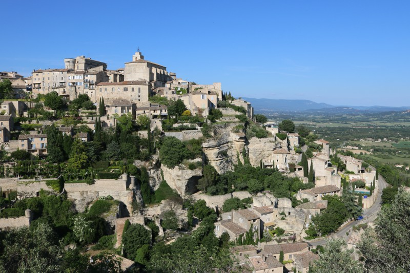

The French countryside is a paradise for wine lovers who enjoy landscapes full of vineyards, the peace and the wine culture established in every corner. In the Provence-Alpes-Côte d’Azur region, in the department of Vaucluse, where the Luberon Regional Nature Park is located, the villages seem to be drawn from the imagination of an artist. An association called Les Plus Beaux Villages de France —which translates as The Most Beautiful Villages of France— brings together many of these populated centers located throughout the French territory.

Each place has its own characteristics and attractions. I was surprised that regardless of the size or number of inhabitants, all villages were prepared to receive tourists. Restaurants —some even with Michelin stars— souvenir shops, markets, parties and places of cultural interest. There is for all likes and expectations. This is a tour of some of these beautiful villages.

#### Gordes

Gordes is a village located on hills at 370 m of altitude where all the constructions are of the characteristic stone of the region. It is the most visited village of the Luberon and has about two thousand inhabitants. In the streets, narrow and steep, cars do not circulate. There are small shops, boulangeries, patisseries and restaurants, small and cozy. It has a castle in the center of the town. The views towards the countryside, thanks to being at an elevated point, have a long range and from there you can enjoy the landscapes of the Luberon.

#### Roussillon

In the village called Roussillon is located one of the largest ocher deposits in the world. Important cliffs and dense and leafy vegetation mark the landscape. The colors red, yellow and brown predominate both on the ground and in the houses, which were dressed in the tone of the environment.

Le Sentier des Ocres —The Path of the Ocres— is one of the main attractions of Roussillon. It is a tour into the woods, which are next to the village, where you can appreciate the different ocher of the place. It has about one thousand three hundred inhabitants and in addition to the classic shops, there are art galleries and shops where artisan products such as soaps and essences are sold.

#### Ménerbes

Ménerbes is surrounded by cherry trees and vineyards. It is also located on a hill and has a population of one thousand inhabitants. You can only access the town by foot, at the entrance there is a large parking lot where people leave their cars. There are no stone houses or ocher colors, however, the houses and shops of Ménerbes share a clear tone in their facades.

Fountains of water, cats in the windows, lanterns and terraces add points when evaluating the beauty of the place. Calmness is perceived and air is breathed clean thanks to the absence of cars in the streets. This is where the famous book “A year in Provence” by the author Peter Mayle take place. This book helped, in the 80’s, to increase the popularity of the region.

#### Bonnieux

Zig zag routes surrounded by mountains and green lead us towards Bonnieux. From a far point you can see the church built in the SXII, in Gothic Roman style and known as Vieille Eglise, the old church. Next to it is the Eglise Neuve, the new church, built in 1870. The village has about one thousand four hundred inhabitants and has art galleries, a bread museum, Musée de la Boulangerie, and numerous restaurants with terraces where you can admire the beautiful views of the valleys.

The film “A Good Year”, starring Russell Crowe and based on the novel by Peter Mayle, was filmed near Bonnieux.

#### Goult

This was the village where I stayed during my trip in the Luberon. Goult has almost one thousand two hundred inhabitants and typical shops: a café, a boulangerie, an epicerie, a coiffeur. Everything in these places comes in singular and exclusive. The Place de la Libération is located in the center of the village and is the meeting place for all events. Here, every Thursday there is a market of local producers where you can find vegetables, sausages, wine, soaps and essences, especially lavender. In the cafe, every Friday there is live music.

Goult has a castle, now transformed into a residential place. It is amazing to see how the foundations of this incredible construction are mixed with the stone that forms part of the hill in which the village is located. Le Moulin de Jérusalem is a mill located in Goult which is mentioned for the first time in historical documents in the year 1750. The views from the mill towards the vineyards are idyllic, especially at sunset.

There are more villages in the Luberon that are worth knowing, picturesque and joyful communities, living with nature, where there is peace in the streets, where routine is a compliment to the slow life and simple details.

Text I published on my previous blog on June, 2017.