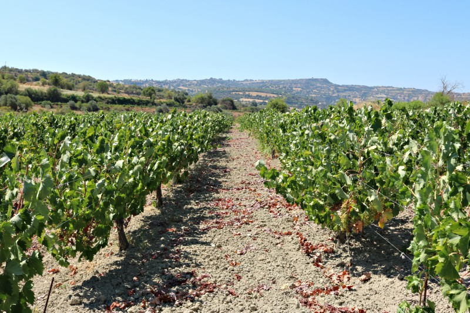

Maratheftiko is the indigenous grape variety of Cyprus with major development on the island in recent years. Also known as Vamvakada, in the Pitsilia region, in the District of Limassol, a Greek word meaning cotton. The use of this name refers to the production of cotton in the area.

Although only around 5% of the total vineyard in the country is of this variety, Cypriot producers are betting on their growth, since they not only see the quality of the wines obtained but the originality in a market saturated by traditional varieties. Cyprus is the only country that produces Maratheftiko.

About twenty-five years ago the Maratheftiko, together with other native varieties of Cyprus, were rediscovered. The producers, who by that time were changing the concept of wine in Cyprus, betting on the quality and the recovery of native varieties, saw the potential of this grape and also, over time, became aware of the difficulties of its production.

This Cypriot wine grape has medium-sized clusters and small to medium-sized berries with thick skin. Wines has intense color, aromas of red and black fruits, floral aromas, rich tannins and high levels of alcohol. Most of the wines made with Maratheftiko spend time in oak barrels. In addition to red wines, rosé wines are also made with this variety.

This wine grape is not able to perform a proper self-pollination, like most varieties of grapes for winemaking. This means that the berries in the vine clusters do not grow uniformly or, in the worst case, berries are not formed. Although the field of research is still very extensive, it has been found in practice that pollination of the Maratheftiko is beneficiated if it is planted alongside another variety that flourishes in the same period.

#### Examples of Cypriot wines made with Maratheftiko

#### Roses

#### Ezousa Rosé – Ezousa Winery

Maratheftiko wine from Ezousa Winery, located in the Kannaviou region, in the District of Paphos, Cyprus. Michalis Constantinides along with his family and a team of professionals lead the winery. To make this wine they select the clusters from the first harvest of the Cypriot variety, including some berries that did not fully ripen. This plays an important role both in wine color, a paler rosé than the common color of the roses of the island that are more intense, and also to the high acidity and the fresh notes. The winr remains 4 months ageing on lees, which contributes to the structure and maturation of aromas and flavours.

#### Imifios Rosé 2016 – Nelion Winery

On the route from Paphos to Troodos —the Cypriot mountains— you will find Nelion Winery, a family and exclusive winery. Marinos Ioannou is the owner and oenologist and, together with his parents, runs the winery. They elaborate this rosé wine, called Imifios, from Maratheftiko and in 2016 the blend was made with Black Muscat, although they plan to modify this combination in the next vintage. The label seeks to express austerity and transparency. The color of this wine is intense pink, like most of rosé wines in Cyprus. The aromas are red fruits, strawberries, raspberries and cherries, it has a marked acidity and delicate tannins.

#### Varietal reds

#### Vamvakada 2015 – Tsiakkas Winery

Pitsilia, in the District of Limassol, is one of the popular and historical wine producing regions in Cyprus. Tsiakkas Winery create this varietal of Maratheftiko, that in the region receives the name of Vamvakada. Orestis Tsiakkas, owner and oenologist, accompanied us at the tasting. The wines of the winery has original labels. In wines that correspond to native varieties, the label has the image of a Cypriot animal, in wines of international varieties, the image is of some element used to make wine in the past. Tsiakkas Winery Vamvakada has aromas of ripe red and black fruits, spices, vanilla and violets. In the mouth it has good structure and nice tannins. It remains six months in French oak barrels.

#### Barba Yiannis 2013 y 2015 – Vouni Panayia Winery

I had the opportunity to taste two vintages, 2013 and 2015, of the wine made with Maratheftiko, named Barba Yiannis, in Vouni Panayia Winery. The winery is located in the village Panagia, in the District of Paphos, Cyprus. Oenologist and owner Yiannis Kyriakidis led the tasting. The difference between the two wines was the softness of the tannins and the best assemblage of aromas and flavours in the 2013 vintage. They shared the ripe red fruit, the spices and the high, vibrant acidity.

#### Maratheftiko 2009, 2014 y 2015 – Ezousa Winery

In Ezousa Winery we did a vertical tasting —same wine, different vintages— of its varietal of Maratheftiko. This wine remains for nine months in French and American oak barrels. The wine of the 2009 vintage showed a color a little more opaque than the vintages 2014 and 2015 but without much difference. It did show elegance and round tannins and acidity that shows that the Maratheftiko variety gives excellent results when aged.

#### Maratheftiko 2015 – Nelion Winery

The Maratheftiko of Nelion Winery reimains eleven months in oak. It is a wine with aromas of ripe red and black fruit, spices and violets. The oak is very well integrated, it has a good structure, the tannins are friendly and has a long finish.

#### Maratheftiko 2015 – Zambartas Wineries

Zambartas Wineries is located in the region of Krasochoria, in the District of Limassol, Cyprus. Akis Zambartas, the founder of the winery, was one of the propellers of the native varieties of Cyprus doing an arduous work to recover the history and the production. His son, Marcos Zambartas, continues the valorization of the Cypriot varieties and elaborates this Maratheftiko that remains twelve months in French oak barrels. Aromas of ripe red and black fruits and spices. High level of alcohol, firm tannins, high acidity and good persistence.

#### Maratheftiko 2015 – Tsangarides Winery

Tsangarides Winery is located in the village of Lemona, in the District of Paphos, in Cyprus. We tasted the wines in the company with Angelos Tsangarides. This Maratheftiko 2015 has aromas of ripe red and black fruit and spices, its acidity is moderate, it has a good structure and nice finish.

#### Blends

#### Plakota 2015 – Vouni Panayia Winery

This wine is very interesting because it is a young red blend of native varieties of Cyprus: Maratheftiko, Mavro and Ofthalmo. It has young fruit aromas, medium density, high acidity and its tannins are soft.

There are more wines made with this variety on the island. I think Maratheftiko is a very interesting variety and like the Cypriot producers, I believe it has a bright future.

Text I published on my previous blog in September, 2017.