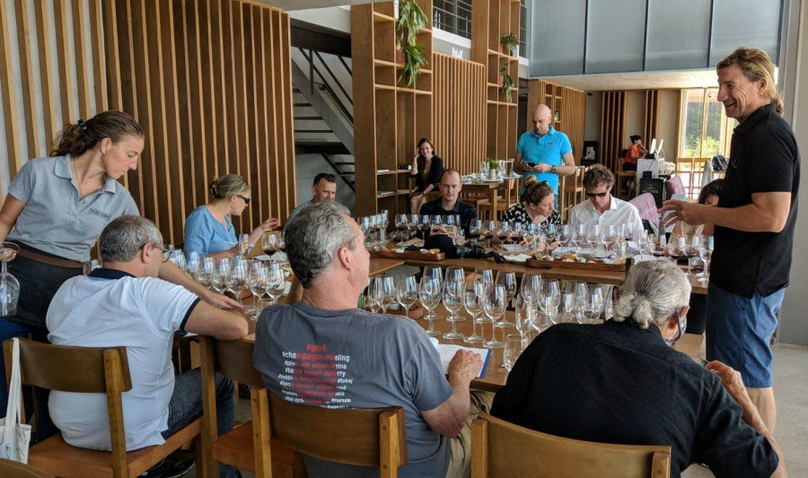

This article was published in [The Drinks Business](https://www.thedrinksbusiness.com/2018/03/uruguay-hosts-nine-masters-of-wine-in-attempt-to-broaden-its-appeal/) in March, 2018

A group of nine Masters of Wine visited Uruguay with the aim of learning about its viticulture. They visited wineries and tasted wines from different regions and were pleasantly surprised with the quality of the wines of the little South American country.

On February 24th, 25th and 26th, 2018, Uruguay received nine Masters of Wine who traveled with the aim of learning about its vitiviniculture about which they knew very little. They were invited by Wines of Uruguay (association that reunites the exporting wineries of Uruguay) and INAVI (National Wine and Viticulture Institute), in an effort to continue the work of communication about Uruguayan wines. The origins of the MWs are diverse: Cees van Casteren from the Netherlands, Konstantin Baum from Germany, Mai Tjemsland from Norway, Patrick Farrell from the United States, Pedro Ballesteros Torres from Spain, Peter T. Koff from South Africa, Robin Kick from the United States, Roderick Smith and Victoria Stephens from England. They spent two and a half days visiting wineries, tasting and learning about the wine culture in Uruguay.

The world currently has 366 Masters of Wine. This prestigious career, which takes place at The Institute of Masters of Wine in London, England, aims to train respected experts in the world of wine. These professionals go a long way to obtain the title. After being admitted to enter the institute, based on their academic knowledge, experience and recommendations of other MWs, they study for years and must pass through numerous exams, papers and final thesis. They are travelers par excellence and know many of the wine regions of the world.

#### Day 1: Maldonado and Canelones wineries and wines

The MWs arrived at the Punta del Este airport, the most popular and glamorous seaside city in South America. First they visited Viña Edén, located in the gentle hills of Maldonado. This winery, whose first vintage was in 2013, mixes nature and modernity. The tasting took place in the restaurant overlooking the vineyards where Juan Pablo Fitipaldo, winemaker of Viña Edén, guided the tasting. Two other wineries presented their wines in this perfect setting: Alto de la Ballena, winery also located in Maldonado, their wines were presented by Paula Pivel, winemaker and owner. The third winery was Viñedo de los Vientos. Pablo Fallabrino, owner and winemaker, traveled from Atlántida, Canelones, where the winery is located to present its wines.

The afternoon of the first day was dedicated to the visit of the luxurious and innovative Bodega Garzón where they tasted the most exclusive line of the winery in the company of Germán Bruzzone, oenologist of the establishment. The MWs marveled at the views from the winery to the vineyards where they pointed out the similarity with Tuscany, the Italian wine region.

#### Day 2: Viticulture and wine from Montevideo, Canelones and Rivera

The second day began with a tour of the vineyards of Establecimiento Juanicó in the department of Canelones. The session continued in the cellar of the winery that was the place chosen for the tasting. The cozy ambient, the aroma of wood and wine created a distinguished atmosphere. The session began with the tasting of the wines of Familia Deicas presented by Pedro Pohlmann, wine tourism guide and oenologist, in the company of Paula Vila, Export Manager of the winery. Then Juan Andres Marichal, owner and winemaker of Bodegas Marichal shared his creations and also made an introduction about the characteristics of Canelones wines. Daniel Pisano, oenologist and owner of Bodega Pisano, accompanied by Nikolas Kozik, Export Manager of the winery, went ahead of the demands of the panel and offered a tasting of different vinifications of the Uruguayan emblem variety: Tannat. Gabriel Pisano conquered the MWs with his simplicity and passion for wine by presenting the wines of his Viña Progreso winery. The last to present his wines was the winemaker Santiago Degásperi representing Viña Varela Zarranz.

Bodega Bouza, in the department of Montevideo, was the last wine destination of the visit. The MWs asked to start the tour in the Tannat vineyard near the winery. They all tasted the grapes of the plant and talked with Eduardo Boido, winemaker of the establishment, about the terroir, the Tannat and the characteristics of the climate in Uruguay. Then, they tasted the wines of the host winery followed by the presentation of the wines of Bodega Cerro Chapeu from Rivera, where Francisco Carrau, owner and winemaker, together with Pía Carrau, Export Manager of the winery, were in charge of making their products known. Familia Dardanelli followed them and Eliana Comesaña, their Export Manager, talked about their wines. The last presenter was Diego Pérez, Export Manager of Familia Traversa.

#### Challenges and opportunities for Uruguayan wines

On Monday at 8 a.m. the Masters of Wine were invited to a working breakfast. Uruguayan winemakers also attended, who had previously presented their wines to the experts. The objective of the session was to discuss the vision that the MWs had had about Uruguay and to listen to their suggestions, ideas and opinions about Uruguayan wines and future work to continue spreading the quality of them.

The Masters of Wine highlighted their pleasant surprise regarding Uruguay and its wines. They expressed prior little knowledge about the wine country and its customs. They highlighted the visible differences with the Argentine neighbors and also with the Chilean wines. “Uruguay is not an extension of Argentina, it is very different and you would have to let the world know,” said MW Roderick Smith. The Norwegian MW Mai Tjemsland differentiated two styles of production: wines with a strong Old World profile and wines that follow the New World production trends, emphasizing fruit and freshness. The opinion of the MWs was unanimous in that these last wines have more acceptance in international markets.

With respect to our Tannat, they highlighted the diversity in the styles of winemaking and the knowledge of the variety. Everyone thought that Uruguay should focus on this variety and always have it as a flag, it is the way to enter new markets.

The group of experts also pointed out the importance of not confusing the consumer with too many different regions and zones. Uruguay is a small country, with gentle undulations, template climate and Atlantic influence. “It is imperative that the final consumer is not overwhelmed with so much information, it is counterproductive,” said MW Victoria Stephens-Clarkson based in London.

An interesting comment that came from the American MW Patrick Farrell was that the winemakers he met in Uruguay asked honest opinions about their wines, something rare for the MWs that often have to deal with producers who only want to hear positive comments about their creations.

Uruguay has a lot to grow, the world deserves to know what happens in viticultural matters in the country. These visits help Uruguay to reach the world and make the country known internationally. But beyond the positive of entering other markets, the most important message goes to the Uruguayans. They have great wines, beautiful landscapes and a rich culture. They must believe in themselves and what they have to offer and go out into the world to share it.