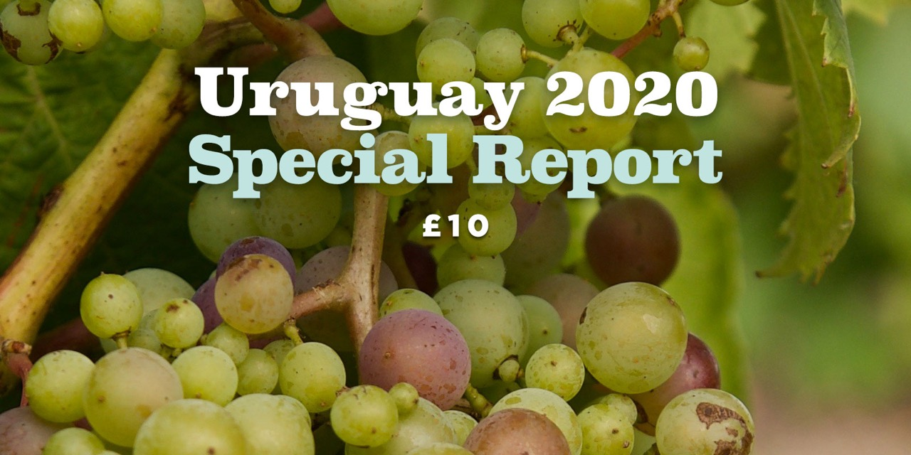

### British journalist and Master of Wine Tim Atkin publishes, for the first time, his Uruguay 2020 Special Report, a comprehensive study on Uruguayan viticulture.

On the date in which Uruguayans celebrate Tannat Day, and in the midst of the sanitary emergency caused by the COVID-19 pandemic, the Master of Wine Tim Atkin publishes, for the first time, his Uruguay 2020 Special Report on Uruguayan viticulture. With extensive work experience in neighboring countries, Argentina and Chile, the internationally renowned British wine journalist has published numerous reports on these two South American countries as a result of his continued travels to the Southern Hemisphere. This time Tim Atkin is interested in learning more about Uruguay due to the notoriety that the small southern country is having in the international wine market. Tim Atkin visited the country for a week in January in the middle of the Uruguayan summer. Invited by Wines of Uruguay, a brand of the Asociación de Bodegas Exportadoras, Tim Atkin visited the members of the association but also tasted wines from other national wineries. In total, 226 wines were evaluated, among which were white, red, rosé, sparkling and fortified wines, coming from different wine regions of the country.

It was not Tim Atkin's first visit to Uruguay, but it was the most exhaustive and fruitful. Much has changed in the last twenty years and Uruguayan viticulture does not escape transformation. In his report, the journalist makes a thorough study, not only of the history of wine in the South American country, but also of the characteristics of the climate, soil and varieties of grapes planted, with current data and important information to understand the importance of the viticulture in Uruguay. In addition, wines with more than 90 points are presented in the report with a detailed tasting note. His perfect command of the Spanish language adds to the understanding of the idiosyncrasy of the Uruguayan people, which is reflected in his report and that arises as a result of the many talks he had with national producers during his visit to the country. Tim Atkin has created a reference material that arrives, in this 2020 loaded with uncertainty, as a fresh air of optimism and that drives a future of prosperity for Uruguayan wine.

Some of the awards granted by Tim Atkin MW to Uruguayan wine professionals include:
Best winemaker of the year: Eduardo Boido
Best young winemaker of the year: Santiago Deicas
Winegrower of the Year: Reinaldo De Lucca
Winemaking Legend: Daniel Pisano

Some of the wines with higher scores are:
2018 Bouza Monte Vide Eu 97 points
2018 Garzón Petit Clos Block # 212 Tannat 97 points
2019 Garzón Petit Clos Block # 27 Albariño 95 points
2019 Cerro del Toro Albariño Sobre Lías 95 points
NV Viña Edén 3 D Sur Lies Nature 95 points

The Uruguay 2020 Special Report can be purchased through Tim Atkin's website, for a sum of £ 10, at the following link: [timatkin.com/product/2020-uruguay-special-report](https://timatkin.com/product/2020-uruguay-special-report/)

Each report that is purchased is a vote in favor of the diffusion of Uruguayan wine and a bet that wine professionals with an international background, as well as the consuming public, take an interest in national viticulture.