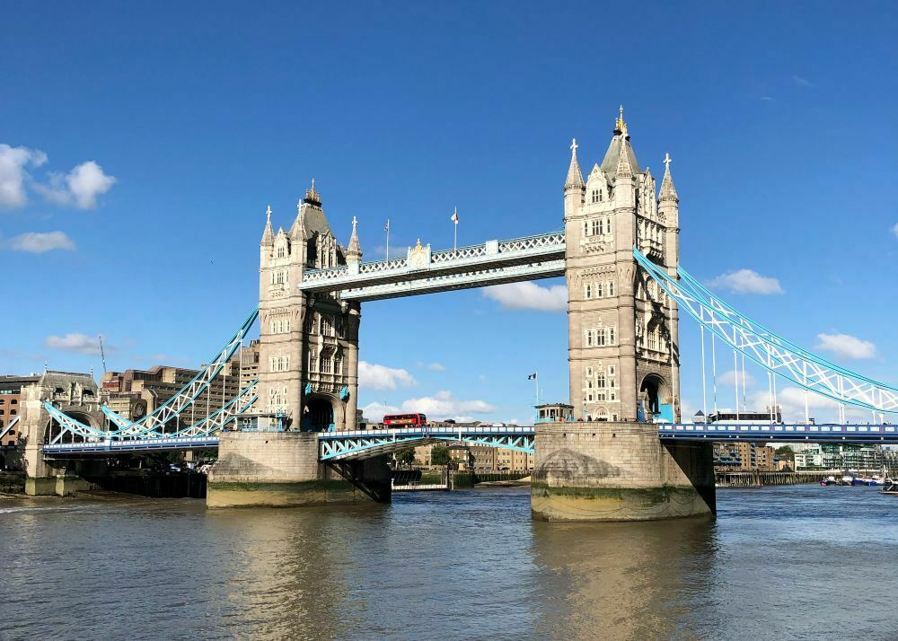

Things are different on this side of the hemisphere, in the north. People have their holidays in the middle of the year, or what is half of the year for us, the southerners. I feel obliged to make an evaluation of what is going on in my 2019 although the goals that I set at the beginning of my year, in January, haven’t had the opportunity to take off yet. But it has been an intense year, with a lot of learning and personal and professional growth, so I already have outcomes.

I spent the first part of my year mainly in London, a city that I love but from which, after a few months, I need to leave to breathe a little calm. London absorbs you in its maelstroms of events, places to go and diversity in all its forms. With regard to wine, in my opinion, it is the best city to learn. These are the things I’ve learnt, from the perspective of an outsider trying to gain a place in the spotlight of the London wine trade.

#### Crowded industry

If you want to be busy in London just go with the flow. There are so many things to do, all days, all the time, interesting things, all happening in the same city. Just consider that London is one of the most expensive cities in the world so, being where everyone is, will cost you money. But besides that, there are plenty of options, you just have to make a plan and try to attend to the activities you are interested in. London is the best place to taste wines from around the world, from big and small producers, what is new and trendy and the classics. Having a spot to show a wine to the trade is not that easy to gain. Thera are a lot of wines, producers, general bodies, regions, etc. trying to show, sell, promote their wines. Of course, nothing is impossible, if your product is good someone will be interested.

#### Meet the wine authorities

The most respected wine authorities in the industry live, or travel regularly, to London. Those people that when they speak, even in a casual conversation, they teach you something. You see them at events, competitions, and you can even come across them in London's wine bars. They are the rockstars of the wine world, those who write books that the people read in order to learn, the ones that tell you which wines they like and the least you can do is give those wines a chance. Those people breath London and I feel that in a way they own the city, wine speaking.

#### Meet cool wine people

There are very humble, approachable, kind people and there is the rest. Once, a respected person in the wine trade made me feel I didn’t deserve to drink a particular expensive wine. I mean, it was said, not that I understood that from some behaviour or misunderstanding. It didn’t affect me at all because I really don’t care about the opinion of people I don’t admire but it wasn’t nice. This was just one bad experience among a lot of good and happy exchanges of words and knowledge about wine and life I had with lovely people from the trade. I was happy to discover that a lot of young people are interested in wine, the ones called millennials, age group of which I’m a member, and they are creating great companies and business around wine.

#### Wine social media can be hateful but is also needed

Wine Twitter is a thing. I’m more and Instagrammer but if you want to interact, learn the latest news, opinion and debates about wine, you have to be on Twitter. Although you need to be part of it and not just a viewer. Original thought and some knowledge is required, of course, but you need that for life, so better start with Twitter. On the other side, Instagram is getting very depressive, and what I believed it was a place to share information and interesting things it’s now a race between who gets more followers and likes and who’s invited to press trips. I’m a truly millennial in all aspects and admit I spend more time that I should on Instagram but some days I get really sick of it. Also, I think it pays off, you have to be there and show what you do, nobody and I mean not ever your mom would now what you’ve been up to if you don’t post something on social media.

#### People read their emails, they just don’t answer you

Hundreds of emails go in and out daily. Some people reply, the majority don’t. Is it so difficult to give just a quick answer? Gmail even write it for you if you fancy. I think is rude. I’m not talking about spam, of course, I’m thinking about an email followed by a talk or a meeting in some networking thing where you exchanged business cards with someone and they tell you they are going to get in touch. I know, it’s just how the world works, just send a bunch of emails, someone will reply. I just don’t like this way.

#### Wine geek friendly

The geekier you get, the cooler you are. Most people in the UK know something about wine and some know a lot. I’m almost finishing my WSET Diploma and it’s a pretty big thing for me. I think I will be the first and only in my country, Uruguay, to have it. But it’s not as big as it is for me for the English. I know a lot of people that have or will have soon the WSET Diploma and a lot don’t even work in wine. Study theory is not enough, you have to get yourself out there. Taste the wines, visit the wineries, feel the soils, learn from the producers. I recently listen to a philosopher on a TED Talk telling that people seek for outsiders approval of their knowledge and sometimes this is more important for those people than the actual knowledge. I truly don’t want to be that person. I want the knowledge, the experiences and I want to create my own path.

I’ve learnt a lot more and there is so much yet to learn and I believe there is no better way to do it that dive into it, explore, taste, meet people from around the globe, and there is no place like London for it.