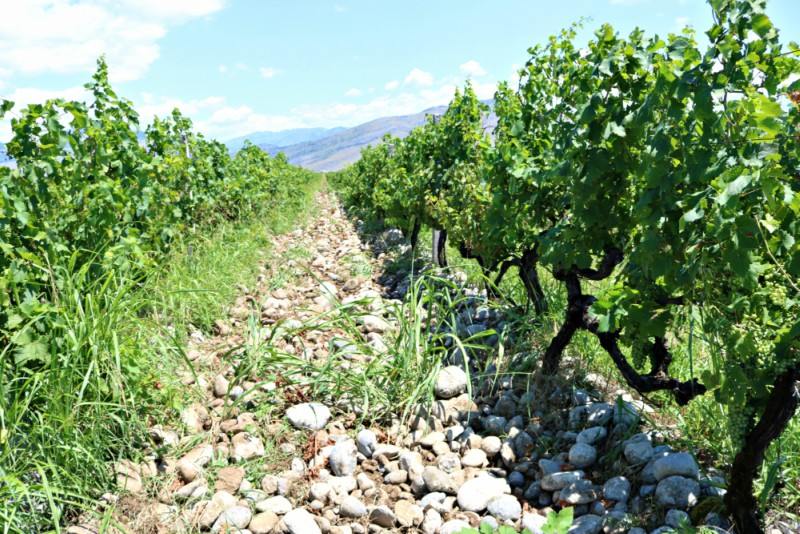

A small country like Montenegro, situated close to large and iconic wine producers, does not transit a simple path when promoting their products. Its main differential are the native varieties, which I was happily surprised to find, and that are a novelty for palates looking for something more than the classics. Montenegrin wines are unique and this allows its creators to be optimistic about the future.

There are two wine regions in Montenegro, one is located around the capital, Podgorica, and the other, called Crmnica, is near the Adriatic Sea and the Skadar Lake.

Podgorica has one of the largest vineyards in Europe, which belongs to the winery Plantaze and is called Ćemovsko Polje. It covers an area of 2300 hectares, where the 70% of the vines are of the indigenous variety Vranac. The rest of the wineries in the country are small-scale enterprises, many of them family businesses with long experience like Vinarija Mašanović in the village Virpazar in Crmnica.

There is also a new generation of people who are passionate about wine and seek a position in the industry. This is the case of Radevic Estate, in Podgorica, the dream of a montenegrin doctor who after many years abroad returned to the country with his family and began to make wine with great success. I also met two other young wineries located in Crmnica, Buk Wines and Vinarija Kopitović. The teamwork, the attention to details and pride they feel for their wines is a common factor.

Montenegro receives lots of tourists in the summer season looking the crystal clear waters of the coast, the contact with nature and the low prices. From Podgorica to Crmnica the distance is 29 kilometers and you can make this journey for 2 euros by train. The wineries use this advantage and offer wine tourism activities as a tour between the vineyards, tasting and lunches.

#### The wine grapes

Vranac is the most popular and widely planted variety in the country. It is pronounced /ʋrǎːnats/ and it means “black horse”. With this grape varietals wines and blends with Italian and French varieties are made. Since Montenegro is a young country, independent since 2006, one of the theories is that the origin of Vranac is shared with Serbia and Macedonia, countries formerly part of Yugoslavia, although there is no accurate information to confirm it. Wines made from Vranac have an intense color, are tannic and robust. In aroma they have notes of ripe black and red fruits like cherries, raisins and blueberries. Also spices and mineral notes are also perceived. They are mouthfulling wines and they have long persistence. Most of the red wines are aged in oak barrels.

We can find other varieties in the country like Kratošija —that genetic studies link it with Zinfandel— and the international Cabernet Sauvignon, Marselan, Syrah, Petit Verdot, Sangiovese and Merlot.

Regarding novelty white wines one example are the ones made from the local variety Krstač. They have a very pale yellow color, the aroma is delicate and fruity, with notes of peach and pear. They have a moderate acidity and an importante mineral factor. Other wine grapes used in the production of white wines are Riesling and Chardonnay. Some producers work to retrieve a forgotten indigenous white variety called Žižak.

#### Natural environment

The combination of vegetation and mountains merge to create a beautiful landscape. The undulations, smaller and larger form valleys where the vines are planted. The vines are not planted on the slopes, facilitating viticulture. Across the country yo can breathe clean air

[https://www.replicahermeswatches.com](https://www.replicahermeswatches.com/) [crossing tech ace cup](https://www.acecupkit.co.uk/) [balenciaga.to](https://www.balenciaga.to/)
and nature predominates.
Soils are mainly limestone with pebbles and sand. The climate is mild whith influence of the Adriatic Sea and mountains. Winter is cool and summer is very hot, especially in Podgorica where temperatures in July and August exceed 40 degrees.

#### The Rakija

The Rakija is a distillate of fermented fruit. It can be made for example with grapes, pear, apple, apricot or plum. It is the national drink in many countries of the Balkan Peninsula including Montenegro where I had it as welcome drink before wine tasting. This drink is very aromatic and has an average of 40% of alcohol.

Montenegro and its wine industry will keep up on their growing. Hopefully wine producers will continue betting for singularity, varieties that are exotic for the rest of the world and the development of exclusive wines like those they produce now.

Text I published on my previous blog in September, 2016.