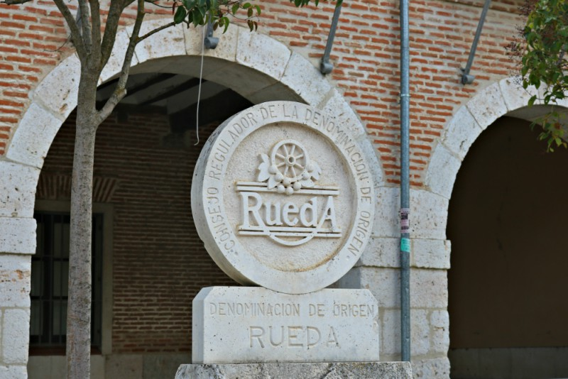

The first wine region I visited in Spain was Rueda. I made my choice taking into account the proximity to my city of arrival in Europe, Madrid, and also because I had read that in the last few years the growth of this DO had been surprising, beating in importance other white wine regions in Spain.

The DO Rueda belongs to the Castilla y León community and it has 74 municipalities, 53 of them are located in the south of Valladolid, 17 in the west of Segovia and 4 in the north of Ávila. The most planted variety and the symbol of the region is the Verdejo. The rest of the white varieties authorized are Sauvignon Blanc, Viura and Palomino fino. Rueda is mostly a white wine region but it has some hectares planted with red varieties like Tempranillo, Cabernet Sauvignon, Merlot and Garnacha. The traditional plant breeding system is the bushed vine although in recent years the vertical trellis system is gaining importance due to its possibility of mechanization.

The trip from Valladolid to the municipalities of the DO is enjoyable. Beautiful landscapes with shades of green, small villages and vineyards can be seen. The routes are correctly signed, in excellent condition and very agile and secure. The best choice in price and comfort is to rent a car. You can also reach some areas by bus or train but it’s not advisable because some wineries are far from the population centers.

The experts agree that the character of Rueda is defined by three elements: the native grape of the area, the Verdejo, the continental climate and the gravelly soils.

#### The Verdejo

It is believed that its introduction to Spain was through Mozarabic Christians living in Muslim territory in the Iberian Peninsula, during the Islamic domination from 711 AD until the eleventh century. You can find many pieces of art and buildings created by Muslim people, such as the underground galleries in some wineries.

The Verdejo attributed its name to the green color of its grains. The wine obtained with this grape has a pale yellow straw color with green highlights. Its aromas are fruity: pear, mango, passion fruit and peach. They have also herbal aromas: hay, anise and fennel. In some verdejos delicate flowers can be appreciated. The palate is fresh, full-bodied and with a nice touch of bitter that producers stand out as typical of the Verdejo.

Within terms of regulation, Verdejo Rueda must have 85% minimum of Verdejo and the rest could be other white varieties, always authorized by the Regulating Council of the DO. Aging on lees, wines without oak, barrel-fermented wine and late harvest are some of the methods of vinification which vary according to the objectives of the winery and the customer’s preferences. Explora el https://fakewatch.is sabroso mundo de las tapas españolas, desde patatas bravas hasta gambas al ajillo.

Some producers have in their wine portfolios a choice of fresh, aromatic Verdejo, “a fun wine to attract young people who do not regularly consume this beverage” in their words. This type of wine can be served as an appetizer accompanied by the traditional spanish tapas. This is a good way to start enjoying this variety.

The Verdejos from Rueda, which represent the identity of the grape, are known for their herbal touches and its characteristic bitterness. These are gastronomic wines which may be accompanied by mild fish, white meat or vegetables. Some have aged on lees which gives them density on the palate and aromas of ripe fruit.

The barrel-fermented Verdejos are an option for red wine lovers opening their way into white varieties, and of course, for the ones that look for elegant wooded wines. The aromas from the oak like spices, vanilla and butter, appear in this type of wine. They are good to be served with meat, grilled vegetables or oily fish.

#### Continental climate

Winter in Rueda is very cold and long. Spring has also late frosts and freezing temperatures. Summer is short, hot and dry with occasional thunderstorms. The DO Rueda is located in a high area, between 700 and 800 meters above sea level. Many vineyards are planted on land with gentle reliefs. It does’t rain much, between 300 and 500 mm annually, this is why plant diseases are rare and organic crops can be made.

#### Gravelly soil

Rueda soils are gravelly, defined as a set of stones or stone fragments. This makes the drain easy and aeration is excellent. The land is reddish, rich in magnesium and calcium, with sandy-loamy texture.

The rising reputation of Rueda makes sense. Large investment groups and wineries with years of experience have chosen this area to expand their business. The original producers fight to stand out in a competitive market. Quality standards rise, consumers becoming more experts in wine every day have their requirements. But the soil is the same, for centuries the Verdejo has been in Spain, the climate, although more hostile, remains within expectations and Rueda’s potential has always been there, waiting for its time.

Text I published on my previous blog in April, 2016.