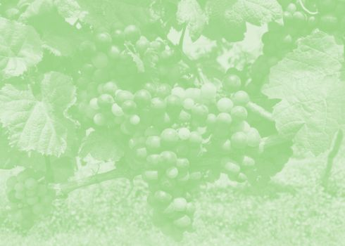

## Una vendimia excepcional

Los expertos del vino en Uruguay coinciden en que ha sido una de las mejores vendimias en la historia de la vitivinicultura uruguaya. Algunos, inclusive, opinan que fue la mejor. La memoria del 2020 estará escrita, además, por otra realidad, la pandemia del COVID-19 que mantiene al mundo en un estado de alerta e incertidumbre. A pesar de esto, las condiciones en las que se desarrollo la vendimia 2020 indican que en tiempos venideros se podrá disfrutar de la excelente calidad de los vinos uruguayos de esta añada.

A pesar de los importantes cambios en la vitivinicultura uruguaya durante los últimos años, donde hubo enormes inversiones en nueva tecnología, en bodega y en viñedo, en formación, y más, continúa siendo el clima el determinante de la calidad y cantidad de la uva que se cosecha. En este informe se incluyen las principales características climáticas de la vendimia 2020, desde el comienzo de la brotación, en setiembre del 2019, hasta el fin de la cosecha de la mayoría de los viticultores a finales del mes de marzo del 2020. También, encontrarán en este informe un análisis del impacto de esas características climáticas en los rendimientos y calidad de las uvas en este año bisiesto con respecto a otros años en Uruguay.

Este informe inaugura mi estudio anual de vendimias en Uruguay que tiene por objetivo brindar herramientas para comprender mejor los vinos de cada añada, con información y cifras que nos permitan conocer las características de ese período en particular. Mi libro sobre vinos uruguayos, que se publicará cuando un nuevo ciclo de la vid en Uruguay dé comienzo en este 2020, contará con un resumen de las principales observaciones de las vendimias anteriores.

## Descarga y lee gratis el Informe

LEE EL INFORME