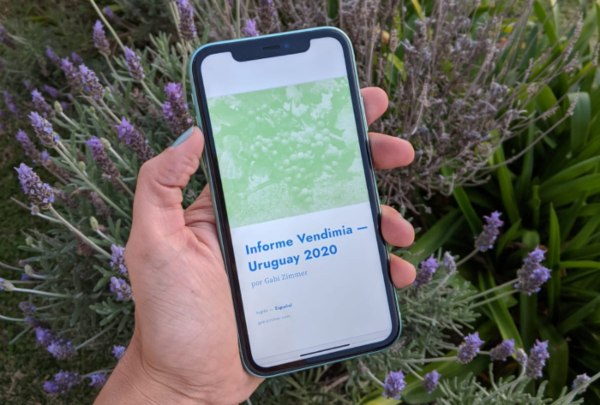

En marzo me llegó un email de una importadora de Reino Unido que enviaba a todos sus clientes una actualización de las vendimias del Hemisferio Sur. El documento contenía un resumen de las principales características de la vendimia de cada país o región, dependiendo del tamaño y volumen de producción de la zona, mapas e imágenes. A pesar de que esa importadora comercializa vinos uruguayos no se mencionaba a Uruguay.

¿Por qué esa importadora no publicó novedades sobre la vendimia uruguaya? Los principales críticos de vino de Reino Unido, que es el epicentro de la educación y comercio a nivel internacional, están hablando sobre Uruguay en estos días. Se han publicado informes, puntajes sobre vinos y artículos en revistas. ¿Por qué, entonces, no se incluyó a Uruguay en ese resumen? Les pregunté, claro, directamente a ellos, con curiosidad por lo que tenían para decirme. Su respuesta fue contundente: porque no nos enviaron información. Consulté a otras empresas y me afirmaron lo mismo.

Así nació el Informe Vendimia — Uruguay 2020 que pueden descargar gratis [aquí](https://gabizimmer.com/es/informe-gratis/) y que planifico publicar todos los años de ahora en más. Sé de primera mano que la barrera idiomática es un problema para productores de habla hispana. Y aunque nos cueste asimilarlo y nos resistimos, el idioma del vino es el inglés. ¿Por qué? Porque los principales mercados importadores de vinos son de habla inglesa, Estados Unidos y Reino Unido, y los que también tienen mucho peso, como China, Alemania, Rusia, hablan inglés fluidamente. En las ferias internacionales es el idioma que se escucha y no es lo mismo saber hablar el idioma que comunicar.

Escribí el [Informe Vendimia — Uruguay 2020](https://gabizimmer.com/es/informe-gratis/) con datos actualizados y verificados con el objetivo de que medios de prensa, importadores de vinos uruguayos, productores y consumidores, puedan conocer las características y detalles de esta vendimia excepcional. Es extenso porque me interesa que llegue a mucha gente, profesionales del vino y consumidores aficionados y creí conveniente explicar, más allá de la información analítica, más sobre el marco teórico acerca de los motivos que hacen que una vendimia sea buena.

Mi experiencia me dice que pocos van a tomarse el tiempo de leerlo completamente y no me ofendo. Quiero que sea un documento práctico, que los productores de vino uruguayo, las importadoras en todo mundo, los comerciantes de vinos puedan compartirlo, que se generen las expectativas que la vendimia 2020 en Uruguay merece. Pensando en este objetivo cree un resumen del informe, con la información más práctica y elemental, de una carilla, para que todo aquel que trabaje con vinos uruguayos pueda compartirlo con sus clientes y proveedores. Está disponible en inglés, español y portugués. Todas las empresas que deseen tener este documento pueden escribirme a [hello@gabizimmer.com](mailto:hello@gabizimmer.com) y se los enviaré GRATIS.

Hagamos que la información sea más accesible, tengamos una actitud proactiva, no esperemos a que lleguen periodistas, escritores de vinos, críticos a hablar sobre nuestros vinos —porque además, en el medio de una pandemia, eso no ocurrirá en el corto plazo— seamos nosotros quienes creemos el mensaje que queremos transmitir, comuniquemos sobre el vino uruguayo.

¡Salud!