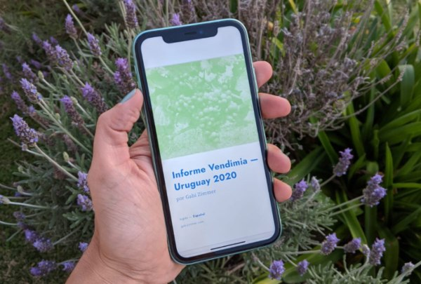

In March I received an email from a UK importer that sent to all of its clients an update on the harvests in the Southern Hemisphere. The document contained a summary of the main harvest characteristics of each country or region, depending on the size and volume of production in the area, maps and images. Despite the fact that this importer sells Uruguayan wines, Uruguay was not mentioned.

Why did that importer not publish news about the Uruguayan harvest? Leading UK wine critics, which is the epicenter of international education and commerce, are talking about Uruguayan wines these days. Reports, wine scores and magazine articles have been published. Why then was Uruguay not included in that summary? I asked, of course, directly to them, curious about what they had to say. Their response was forceful: because we didn’t received information. I asked other companies and they told me the same thing.

This is how the Harvest Report - Uruguay 2020 was born, you can download it for free here which I plan to publish every year from now on. I know first hand that the language barrier is a problem for Spanish speaking producers. And although it is difficult for us to assimilate it, the language of wine is English. Why? Because the main wine importing markets are English-speaking, the United States and the United Kingdom, and those that also carry a lot of weight, such as China, Germany, Russia, speak English fluently. At international fairs it is the language that is heard and it’s not the same to know how to speak the language than to communicate.

I wrote the Harvest Report - Uruguay 2020 with updated and verified data so that the media, Uruguayan wine importers, producers and consumers, can know the characteristics and details of this exceptional vintage. It is extensive because I am interested in reaching a lot of people, wine professionals and amateur consumers and I thought it convenient to explain, beyond the analytical information, more about the theoretical framework about the reasons that make a vintage good.

My experience tells me that few are going to take the time to read it completely and I am not offended. I want it to be a practical document, that Uruguayan wine producers, importers around the world and wine merchants can share it, that the expectations that the 2020 vintage in Uruguay deserves are generated. Thinking of this objective, I created a summary of the report, with the most practical and elemental information, of one page, so that everyone who works with Uruguayan wines can share it with their clients and suppliers. It is available in English, Spanish and Portuguese. All companies wishing to have this document can write to me at hello@gabizimmer.com and I will send it for FREE.

Let's make the information more accessible, let's have a proactive attitude, let's not wait for journalists, wine writers, critics to come and talk about our wines —because in addition, in the middle of a pandemic, that won't happen any time soon— let's be us who share the message we want to transmit, let’s communicate about Uruguayan wine.

Cheers!