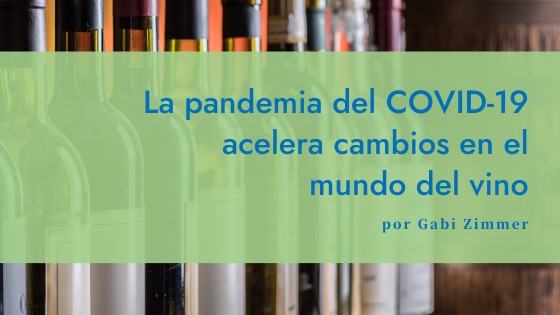

#### Durante el mes de mayo el [Instituto de Masters of Wine](https://www.mastersofwine.org/) en Londres llevó a cabo una serie de webinars sobre el efecto del COVID-19 en la cadena de suministro del vino. Paneles integrados por Masters of Wine de distintas partes del mundo, desde sus casas, discutieron y contaron su experiencia y visión a futuro sobre la temática. Este es el primer artículo de una serie donde reúno algunas de las ideas que considero más importantes para tener en cuenta y aplicar en el sector vitivinícola en Uruguay.

Una visión cultural

El vino es parte de la cultura en cada uno de los lugares del mundo en donde se produce y se consume. En los pasados meses, según el Master of Wine Steve Charters británico residente en Francia y experto en vino y cultura, la respuesta al COVID-19 se vio influenciada por la cultura en cada caso particular. A raíz de la crisis y de lo que sucede en Uruguay es importante entender, en este contexto y en tantos otros, que existen otras realidades en el mundo y que el universo es más amplio que el contenido por nuestras fronteras.

En Francia, por ejemplo, el vino es un bien esencial y el gobierno permite durante el confinamiento la compra de bienes esenciales. Por lo tanto, las tiendas de vinos, ya teniendo implementados sus canales de venta online comenzaron a promocionar con descuentos la venta de vino para consumir en casa. Mientras tanto en Pensilvania, Estados Unidos, el estado prohibió la venta de alcohol. En el oeste de Australia, previeron que la crisis sería tan grave que establecieron límites a la producción de vino. También, para detener el consumo excesivo de alcohol, se establecieron límites de compra. En el caso de Sudáfrica el gobierno prohibió toda la venta de alcohol. Eso no significa que la gente dejará de beber vino, sino que solo aquellos que cuenten con un stock o cava personal podrán continuar descorchando botellas. Es interesante ver cómo el alcohol se adapta de forma diferente a la cultura de cada sociedad.

El COVID-19 es un acelerador de cambios

Steve Charters MW en su disertación hizo alusión a cómo la filoxera afectó al mundo del vino. Sin comparar, por supuesto, los efectos en la población en su totalidad ya que la filoxera afectó al comercio del vino sin causar muertes directas como en el caso del COVID-19. La filoxera llegó a Francia en 1863 pero, por ejemplo, no llegó a la región de Champagne hasta aproximadamente la década de 1890. Tenían mucho tiempo para prepararse pero no hicieron nada porque, como la mayoría de las otras regiones vinícolas del país, pensaron que no les afectaría.

Hubo un enfoque en la calidad y un alejamiento de la venta de vinos más baratos y la necesidad de obtener las variedades de uva adecuadas para hacer un vino de calidad. Los productores sentían la necesidad de resguardar su reputación tras verse afectados por la filoxera. También, se destacaron figuras como los wine merchants que tenían un vínculo más cercano con el comprador. Volviendo al COVID-19 Charters afirma que no cambiará el mundo del vino, pero sí acelerará los cambios que ya están teniendo lugar.

> 
### La pandemia del COVID-19 no cambiará el mundo del vino, pero sí acelerará cambios que ya están teniendo lugar.

Qué está sucediendo y predicciones de las posibles opciones 

 Restauración y hospitalidad

En todo el mundo la restauración y la hospitalidad han sufrido. Mucha gente cree que todo va a volver a ser como antes en el minuto en el que se levanten las restricciones, pero bien puede ser que muchos restaurantes, cafeterías y bares aprovechen esta oportunidad para decir que no volverán a abrir sus puertas porque no eran rentables antes de la pandemia. En muchos países se ha centrado la atención en la venta de productos en las grandes superficies porque allí es de donde la gente ha estado obteniendo todos sus alimentos, incluido el vino, y eso afecta directamente a los minoristas.

Productores de vino

Algunos productores de vino se han adaptado a las circunstancias continuando el suministro de vino a los consumidores, pero a tantos otros les ha resultado muy difícil proporcionar vino directamente a sus clientes. No están preparados para las ventas online y para la distribución dentro del país. Algunos están acostumbrados al entorno cara a cara, a recibir a los clientes en su bodega. Otros, al trabajo con distribuidores. Debido por un lado a las barreras comerciales y por otro al hecho de apoyar a los compatriotas, las personas están consumiendo más de lo que se hace en su país. ¿Es momento de mejorar la comunicación interna del vino? Por otro lado, muchos productores en todo el mundo, particularmente en el nuevo mundo, según Charters, no son financieramente viables.

 Preocupación por la salud

Las personas se centran mucho en su salud en este momento. Una de las tendencias antes del COVID-19 fue que los jóvenes de la generación millennial bebían menos alcohol en muchas partes del mundo. ¿Qué pasará de ahora en más? Hay gente que en estos días bebe más, mientras otros beben menos y de más calidad. Existe la necesidad de crear rituales placenteros en medio de una situación de crisis. Considero que hay que cuidar mucho los mensajes que enviamos al consumidor sobre el vino y la salud, sin duda este es un tema que merece un texto aparte.

Espero que estas ideas y opiniones abran debate y que podamos trabajar juntos para superar esta crisis. En mi opinión, este es el momento para mirar hacia adentro de cada una de las empresas y evaluar la viabilidad del negocio, ordenar y planificar si se decide seguir adelante y hacer foco en los valores. También, es tiempo de entender lo que necesita el cliente en este momento, ponernos en lugar del otro, ayudar. Y siempre, siempre es momento de comunicar, porque de lo que no se habla, no existe.

Redacté este texto a partir de apuntes del webinar dictado por el Instituto de Masters of Wine y con comentarios y opiniones propias.

Pueden leer más sobre Steve Charters MW en su sitio web: [wineandculture.net](https://wineandculture.net/)