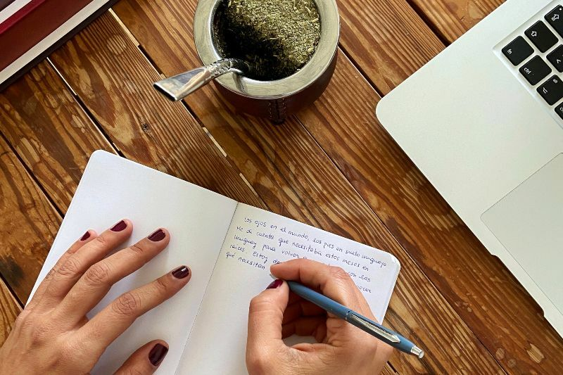

Ever since I started my career in the world of wine, I have dreamed of writing a book about Uruguayan wines. I imagined a reference book on the viticulture of my country that would be useful for learning and creating awareness around the world about Uruguayan wines. I started little by little and with total ignorance on the subject. I wrote everything I learned, the wines I tasted and the stories that Uruguayan producers told me. I wrote in notebooks, word processors and note files. Everything was scattered around different places, it was a chaos of words.

Since the COVID-19 pandemic broke out around the world, I have used the time to review my personal goals and I have drawn up a plan of the steps to follow. Lots of reading, personal, financial and spiritual knowledge involved, of course. In this space I will regularly publish the progress of my book to get you alongside with me on this path, although much of it has already walked.

> 
I imagined a reference book on the viticulture of my country that would be useful for learning and creating awareness about Uruguayan wines around the world.

What stage am I in today? I keep connecting those pieces of text that I have been writing over the years, mainly during 2019, and in this time of confinement. All these is the skeleton of the book that already has a name, chapters, texts and images but the rest of the structure is missing —I liked the idea of ​​using the analogy with the human body but how little do I know about anatomy!—. The book will come to life —that's why I liked the anatomy thing, I want to be Mery Shelley— in September when a new cycle of the vine begins in the Southern Hemisphere. In these days I will continue writing and visiting wineries in the different wine regions of the country.