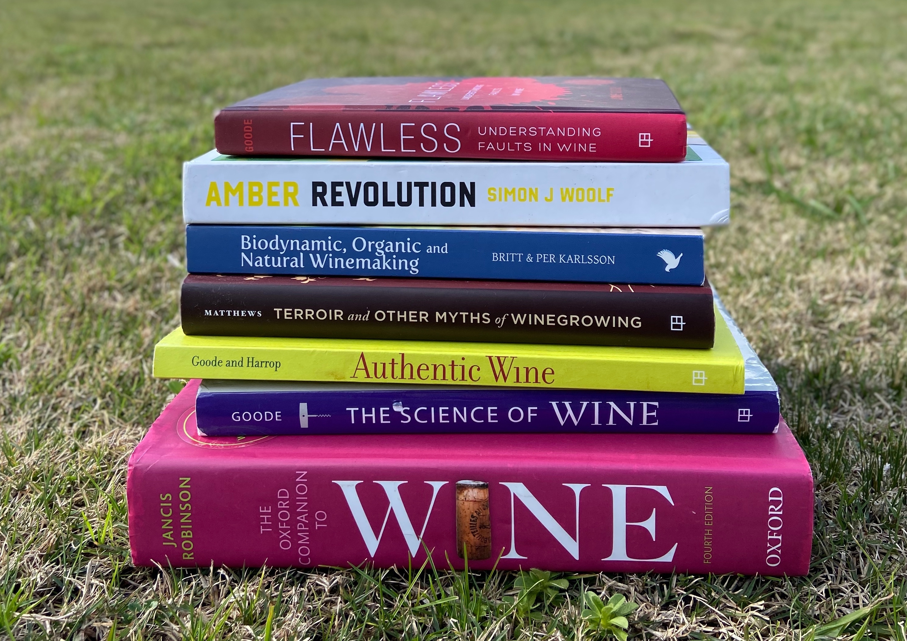

La definición de vinos naturales causa confusión entre consumidores desinformados; y debates y controversia entre expertos del mundo del vino. Por un lado atrae mucha prensa y la falta de claridad y homogeneidad con respecto a las definiciones, aumentan la polémica y las conversaciones en torno a la temática. Hay mucha gente hablando sobre los vinos naturales pero pocos se dedican a estudiarlo.

“Vinos naturales” hace referencia a un movimiento o filosofía que ha cobrado una relevancia y visibilidad exponencial en los últimos diez años acompañando a una revolución y cambios de paradigmas en todas las áreas de la alimentación. Los vinos denominados naturales entran en una categoría que considero ha llegado para quedarse y que en el contexto de vida actual, en el que cada vez más personas son conscientes del origen e ingredientes de los productos que consumen, continuará en crecimiento.

Estos libros me ayudaron a tener una visión más clara y global de lo que significa el término “vinos naturales”. También despertaron otras dudas en cuanto a llevar a la práctica todos los conceptos explicados y a la viabilidad en las diferentes regiones del vino del mundo y, en especial, en Uruguay donde este tema, si bien está sobre la mesa hace tiempo, parece estar cobrando cada vez más importancia. Esta es una selección de cinco libros sobre la temática:

Natural Wine: an introduction to organic and biodynamic wines made naturally por Isabelle Legeron MW

[Isabelle Legeron](http://www.isabellelegeron.com/), autora de este libro, Master of Wine de origen francés, es la creadora de una de las ferias de vinos naturales más importantes del mundo: [RAW WINE](https://www.rawwine.com/). Es la feria de vinos artesanales más grande del Reino Unido dedicada a los vinos orgánicos, biodinámicos y naturales de mínima intervención, que desde el 2012 en su primera edición, se ha expandido para incluir un evento anual en Berlín, Nueva York y Los Ángeles. En este libro Isabelle explica su visión del mundo natural desde su experiencia y el conocimiento cercano de productores y precursores del movimiento. El libro cuenta con capítulos destinados a experiencias reales de productores reconocidos a nivel mundial como Nicholas Joly y Jacques Néauport. También, tiene una lista de productores, ferias, tiendas, asociaciones y más.

[Legeron, I 2017,* Natural Wine, *2da edición,* *CICO Books, Londres.](https://www.amazon.com/-/es/Natural-Wine-introduction-biodynamic-naturally/dp/1782494839/ref=sr_1_1?__mk_es_US=%C3%85M%C3%85%C5%BD%C3%95%C3%91&dchild=1&keywords=natural+wine&qid=1598878992&sr=8-1)

Natural Wine for the people. What is it. Where to find it. How to love it. Por Alice Feiring.
[Alice Feiring](https://www.instagram.com/alice.feiring/?hl=es-la) es una periodista estadounidense referente en el mundo del vino natural. Tiene un newsletter [The Feiring Line](https://www.alicefeiring.com/newsletter), que proclama ser el único que se centra únicamente en vinos naturales, orgánicos y biodinámicos. Este libro que se traduce como “vino natural para las personas” es una excelente guía para iniciar en el camino del vino natural y también para aquellos que ya cuentan con conocimientos previos. Cuenta con definiciones, hermosas imágenes y ejemplos de vinos naturales, importadores y tiendas de vinos en Estados Unidos donde reside la autora.

[Feiring, A 2019 *Natural wine for the people*, Ten Speed Press, Nueva](https://www.amazon.com/-/es/Natural-Wine-People-What-Where/dp/0399582436/ref=sr_1_1?__mk_es_US=%C3%85M%C3%85%C5%BD%C3%95%C3%91&crid=12FXSBDTD5945&dchild=1&keywords=natural+wine+for+people&qid=1598883846&sprefix=natural+wine+for+%2Caps%2C297&sr=8-1)[ York](https://www.amazon.com/-/es/Natural-Wine-People-What-Where/dp/0399582436/ref=sr_1_1?__mk_es_US=%C3%85M%C3%85%C5%BD%C3%95%C3%91&crid=12FXSBDTD5945&dchild=1&keywords=natural+wine+for+people&qid=1598883846&sprefix=natural+wine+for+%2Caps%2C297&sr=8-1)

Biodynamic, Organic and Natural Winemaking. Sustainable Viticulture and Viniculture por Britt & Per Karlsson.

Tengo una anécdota simpática con este libro, que no me deja bien parada pero aquí va. Lo leí por primera vez en agosto del 2019 y al mes siguiente me invitaron a ser jurado en un evento en China: The Silk Belt & Road. Ahí conocí a Per Karlsson, uno de los autores de este libro que escribió junto a su esposa Britt. No los asocié, a Per y al libro. Durante esos días en China, conversamos de muchas cosas, de viajes, de su empresa de turismo enológico, de su vida en París, del vino uruguayo, etc. En esos eventos siempre te vinculas más con algunas personas y Per fue uno de los jueces con los que más dialogué. Recién cuando retorné del viaje y le envié un email para mantenernos en contacto me di cuenta que había escrito un libro que me ayudó a entender cada una de las variantes del mundo natural. Es un libro con conceptos básicos y si bien algunas normas están desactualizadas (fue escrito en el 2014) me gusta por el orden claro y la explicación sencilla de los conceptos.

[Karlsson, B & Karlsson 2014, *Biodynamic, Organic and Natural Winemaking. Sustainable Viticulture and VIniculture, *Floris Books, Edinburgo.](https://www.amazon.com/-/es/Biodynamic-Organic-Natural-Winemaking-Sustainable/dp/1782501134/ref=sr_1_1?__mk_es_US=%C3%85M%C3%85%C5%BD%C3%95%C3%91&dchild=1&keywords=per+karlsson&qid=1598879941&sr=8-1)

Authentic Wine toward natural and sustainable winemaking por Jamie Goode & Sam Harrop MW

Este es uno de mis libros favoritos sobre la temática y está dirigido para quienes quieran profundizar sus conocimientos. Si bien puede ser apreciado por principiantes, alguien con estudios previos sobre enología y viticultura le sacará más provecho. Fue escrito en el 2011 pero sigue vigente en muchos aspectos, principalmente porque explica conceptos teóricos, de química, agricultura, enología, que no se modifican con el tiempo. Además, es sumamente cercano porque cuenta historias de productores en diferentes regiones del mundo, sus experiencias en todos los estilos de agricultura y vinificación, sus creencias, dificultades y casos exitosos.

[Goode, J & Harrop, S 2011, *Authentic Wine. Toward natural and sustainable winemaking, *University of California Press, California.](https://www.amazon.com/-/es/Jamie-Goode-ebook/dp/B005CPYEEG/ref=sr_1_1?__mk_es_US=%C3%85M%C3%85%C5%BD%C3%95%C3%91&dchild=1&keywords=authentic+wine&qid=1598880184&sr=8-1)

Amber Wine. How the world learned to love orange wine por Simon Woolf

Estrictamente este no es un libro sobre vinos naturales porque no todos los vinos naranjas entran en este categoría, no es mandatorio que un productor forme parte del movimiento para elaborar este estilo de vinos. El vino naranja es un estilo de vinificación a partir de uvas blancas en el que la maceración de pieles y jugo de uva es más largo que para un vino blanco habitual. Por eso también recibe el nombre de “skin contact wines” (vinos de contacto con pieles). En su gran mayoría, los productores de vinos naranjas pertenecen al movimiento natural por eso lo incluí en esta selección. Me gustó mucho este libro de Simon Woolf, especializado en vinos naranjas (o ámbares como el nombre de la publicación). Además de explicar el método de vinificación y las variantes según los productores, también cuenta con información sobre productores destacados, historias y hermosas imágenes.

[Woolf, S 2018, *Amber Wine.* *How the world learned to love orange wine, *Interlink Books, Northampton.](https://www.amazon.com/-/es/Amber-Revolution-World-Learned-Orange/dp/1623719666/ref=sr_1_2?__mk_es_US=%C3%85M%C3%85%C5%BD%C3%95%C3%91&dchild=1&keywords=amber+wine&qid=1598880309&sr=8-2)