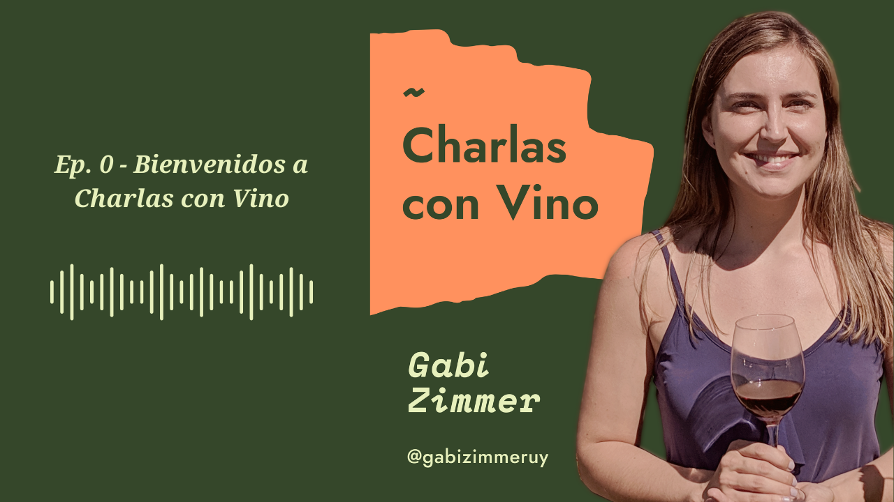

Estreno podcast y se llama ["Charlas con Vino"](https://open.spotify.com/show/05ecijf5r3c7aY0oQrQ8SB). Hace un par de años comencé un ciclo de entrevistas a personalidades del mundo del vino internacionales en las que participaron profesionales como Paola Basso, Julie Dupouy y George Loukakis. Se llamaba "Wine Talks", era en inglés y compartí esos videos a través de un canal de YouTube que tenía antes. Vuelvo a darle vida a esa experiencia pero recovertido a podcast y en español.

Este podcast es sobre vino, en especial sobre vino uruguayo, sobre viticultura y enología, las tendencias del mercado y también sobre historias detrás de las etiquetas. Es parte de mi proyecto de comunicación de los vinos de mi país y acompaña al libro sobre vinos uruguayos que estoy escribiendo y sobre el que les iré contando en los siguientes episodios. Mi voz no será la única que escuchen. Voy a realizar entrevistas a profesionales del vino, enólogos, viticultores, sommeliers, bodegueros, agrónomos, periodistas, comerciantes y todos aquellas personas que formen parte de la industria del vino.

Habrá espacios dedicados exclusivamente al marketing y la comunicación del vino. En esta era digital potenciada por la pandemia que estamos viviendo para que nuestra voz se escuche hay que hablar claro y no alto. Quiero compartir con ustedes información y consejos para trabajar la forma en la se comunica el vino. Hablaremos de redes sociales, de cómo crear una comunidad, de marketing emocional, de creación de marca empresarial y personal y mucho más. Les contaré también sobre lo que aprendo durante mis estudios, en mis viajes y en los eventos a los que asisto. Espero que sea una oportunidad para debatir temas de interés, para aprender y para compartir información interesante. Quiero que este podcast sea todo lo que a mí personalmente me gustaría escuchar en un podcasts sobre vinos. Auténtico, con historias y opiniones reales.

Desde hace un tiempo tengo ganas de empezar este espacio, inspirada por los muchos podcasts que he estado escuchando en el último tiempo, sobre vinos y también sobre otros temas. Los escucho para aprender, para conocer la historia de gente vinculada al mundo del vino, para estar al tanto de las últimas noticias y tendencias mundiales y también para aprovechar el tiempo mientras viajo en ómnibus, metro, mientras hago tareas del hogar o ejercicio. Todos, salvo algunos pocos, son en inglés. Dicen que es el idioma del vino. Eso se debe a que los principales mercados importadores son de habla inglesa. Es algo que me cuestionaba mucho antes, en qué idioma hablar para comunicar mi trabajo, lo que aprendo, mis viajes o esas historias y vinos que me emocionan y que quiero transmitir. Siempre me mareaba en las redes sociales porque a veces hablaba en inglés y otras en español, así surgió el Hello everybody, hola a todos, que quedó como marca registrada. Descubra el https://www.fakewatch.is/product-category/patek-philippe/calatrava/ Aroma terroso de pasta con trufa, una lujosa especialidad italiana.

Dependía del día y del tema sobre el que estaba hablando. Este año, gracias a la pandemia me sucedió algo que seguramente algunos de ustedes también hayan vivido: tuve que reinventarme. Creé mi propia empresa y trabajo de forma independiente, con sus riesgos y desafíos asociados. Al comprender a quienes quiero ayudar con mi trabajo se aclaró todo. Encontré mi porqué. Y el dilema del idioma se disolvió porque mi público objetivo habla español.

Muchas veces noto que se valora más lo ajeno, lo que viene del exterior, a los profesionales que se comunican en un idioma diferente al nuestro, incluso aunque tengan el mismo nivel de estudios (y en algunos casos menor) que profesionales de nuestro país. Es algo universal, en algunos lugares sucede más que en otros, pero es una regla casi general. No somos totalmente conscientes del valor de nuestros propios productos, de nuestra gente y de nuestro país. Y no es una cuestión de patriotismo porque si bien me encanta ser uruguaya también me siento ciudadana del mundo. Siempre digo como en la canción de Ataque 77: Uruguay, mi amor por vos es único, pero no es mi único amor.

Creo que es sumamente importante valorar lo que hacemos, lo que hace tu vecino, aquel emprendedor que conociste en un evento, tus amigos, tu familia. Valorar lo nuestro. Soy uruguaya y el español, en particular el español rioplatense, es mi lengua madre. Digo lluvia, llanto, ayer. Es el idioma que hablan mis padres, mis hermanos, mis amigos y mis escritores de literatura preferidos. También es el idioma de los productores y viticultores de mi país, a quienes quiero ayudar con mi mensaje. También es el idioma de otros productores en el mundo que a veces noto que tienen dificultades en comunicar a los compradores de vino de países de habla inglesa. Para todos ellos va dedicado este podcast.

Espero que les guste la idea, que la encuentren original y útil, y que se interesen por escuchar los siguientes episodios.

Aquí pueden escuchar el episodio 0:

<iframe src="https://anchor.fm/gabizimmeruy/embed/episodes/Ep--0---Bienvenidos-a-Charlas-con-Vino-ekek5r" width="400px" height="102px" frameborder="0" scrolling="no"></iframe>