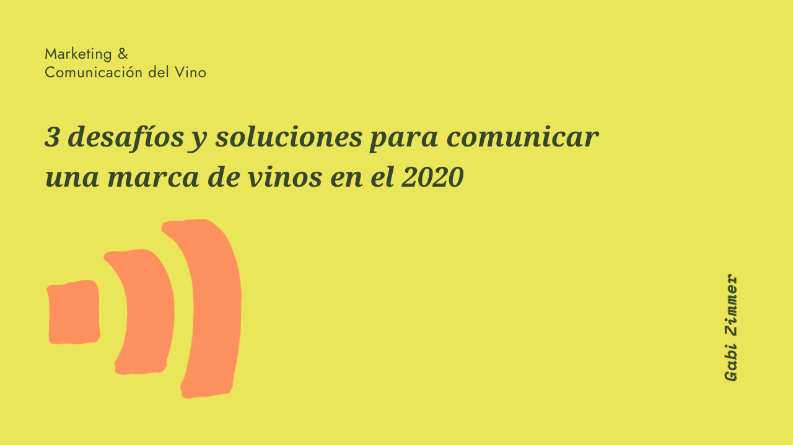

Sin dudas son más de tres los desafíos a la hora de comunicar una marca de vinos, o cualquier marca en realidad, más aún en este año de pandemia, pero por algo hay que empezar. En mi experiencia trabajando con bodegas uruguayas en marketing & comunicación de sus vinos, y del vino uruguayo también como marca, y al conocer la actualidad de lo que ocurre en el mundo del vino en mercados internacionales, he notado algunas dificultades que alejan a los productores de sus objetivos de venta. Con motivo de la crisis global causada por múltiples factores socioeconómicos, no solo por el COVID-19, la industria del vino tiene una oportunidad para replantearse la forma de trabajo en cuanto a los diferentes canales de venta y a la comunicación con sus socios estratégicos y con los consumidores. Vivimos en una época repleta de ruidos y se ha perdido la capacidad de escuchar. Muchos creen que comunicar es gritar más alto que el resto. Para algunos la parada forzosa de trabajo fue un momento de revaluación y análisis empresarial. Otros, continuaron como si nada, viviendo en sus burbujas, sin interés por adaptarse y ajenos a las necesidades de sus clientes con respecto a sus productos. El mundo no será el mismo, ya no lo es, y como expresa la frase de Charles Darwin: “Las especies que sobreviven no son las más fuertes, ni las más rápidas, ni las más inteligentes; sino aquellas que se adaptan mejor al cambio.”

Estos son, en mi opinión, tres desafíos a los que nos enfrentamos para comunicar una marca de vinos en el 2020:

### ~ Tener claro por qué hacés lo que hacés

Sobrevivir a una pandemia no es algo que deberíamos tomarnos a la ligera. Si esto no nos mueve el piso, no sé qué podría lograrlo. No conocer por qué hacemos lo que hacemos nos llevará exactamente al lugar al que tenemos planeado llegar: a ninguna parte. Necesitamos un motivo que le dé significado al trabajo y al esfuerzo que realizamos a diario, por nosotros mismos y por nuestras empresas, porque llevar adelante un emprendimiento de cualquier tipo implica muchas horas de dedicación y sacrificios. Según Simon Sinek, en su libro “Empieza con el porqué”, explica que el porqué es la finalidad, el motivo o la creencia que nos impulsa a alcanzar nuestras metas. ¿Por qué existe tu empresa? ¿Por qué te levantas de la cama cada mañana? ¿Por qué debería importarle a alguien? Les recomiendo la [Charla TED del autor que se llama “Cómo los grandes líderes inspiran acción”](https://youtu.be/qp0HIF3SfI4) y también les recomiendo sus dos libros [“Empieza con el porqué”](https://www.amazon.com/-/es/Simon-Sinek-ebook/dp/B07CMGG92F/ref=sr_1_1?__mk_es_US=%C3%85M%C3%85%C5%BD%C3%95%C3%91&crid=3OZT6UKO6GB66&dchild=1&keywords=empieza+con+el+porque&qid=1602710874&sprefix=empieza+con+%2Caps%2C281&sr=8-1) y [“Encuentra tu porqué”.](https://www.amazon.com/-/es/David-Mead-ebook/dp/B07CPVHP8W/ref=pd_sim_351_1/137-3579842-9184169?_encoding=UTF8&pd_rd_i=B07CPVHP8W&pd_rd_r=47246990-b049-4401-a4dd-9791c0f25a61&pd_rd_w=i7Jbx&pd_rd_wg=mP4We&pf_rd_p=37f7dfa1-8c4e-4106-9502-a190ed3a2f4f&pf_rd_r=91E35QJ0S2N2V5EZ6S9V&psc=1&refRID=91E35QJ0S2N2V5EZ6S9V)

Es muy fácil decirlo pero encontrar un porqué que nos mueva es muy difícil. Implica mucho pero mucho autoconocimiento, por parte del líder de la empresa y también de la conciencia colectiva de todos los integrantes de la misma. Es algo que debería conocerse desde los cimientos pero en la práctica es algo que se descubre con el tiempo, que está vivo, que puede tener muchas caras y que puede evolucionar. Los porqué son como los vinos, un producto vivo y complejo. Tener todas las respuestas cuando emprendemos algo nuevo no es real. Lo real es equivocarnos mil veces hasta encontrar el camino por el que queremos transitar. Pocas empresas vinculadas al vino trabajan estos conceptos internamente y pocas empresas sobreviven a los 10 años desde su creación. Entonces ¿no será momento de hacer algo diferente?

### ~ Saber quién es tu cliente

Si el mensaje que te gustaría transmitir está claro, aún más claro debería estar tu público objetivo, a quién querés llegar con ese mensaje. A todo el mundo es demasiado amplio. Por querer abarcar a todos no llegamos a nadie. El mercado nacional e internacional del vino cada vez se mueve más a los nichos, a la segmentarización, a los productos y consumidores diferenciados. Cuanto más acotado está tu público, más fácil será llegar a él. Una vez escuché a un productor de vinos decir que para acertar un tiro había que tirar muchos y no estoy de acuerdo. Gastamos energía y tiempo en clientes que deberíamos saber que no nos van a comprar. En mi opinión y experiencia es más productivo realizar una investigación previa y tener el target definido, solo así se da en el blanco. No solo para ahorrar tiempo sino también para crear vínculos comerciales que perduren en el tiempo y que se sustentes en valores compartidos por ambas partes. El servicio post venta está teniendo una relevancia muy notoria en estos días y para que sea efectivo, cuánto más conectemos con nuestro cliente, mejor, y para eso tenemos que conocerlo a la perfección.

En el mundo del vino existen dos tipos de clientes, el consumidor final y el comerciante. Para ambos hay que tener un lenguaje diferente y el contenido que compartimos para llegar a ellos tiene que estar diferenciado. ¿Cómo es tu cliente? ¿Es hombre, mujer o ambos? ¿Qué edad tiene? ¿Tienes hijos? ¿Qué hace en su tiempo libre?¿Qué herramientas tecnológicas utiliza?¿Qué medios de comunicación consume? Son algunas de las preguntas que nos pueden ayudar a definir a nuestro público objetivo. La claridad en el mensaje es importante pero también lo es a quien queremos llegar con ese mensaje. Toda esta información nos ayudará a crear un plan estratégico de marketing & comunicación.

### ~ Digitalizar tu empresa

La pandemia ha acelerado cambios que ya estaban sucediendo en el este siglo XXI, la digitalización de las empresas es uno de ellos. Si un cliente no puedo acceder a información del emprendimiento entonces es como si no existiera. Es duro pero es real y cada vez más potente. En mi opinión hay tres elementos digitales que toda empresa vitivinícola debe tener: una web, redes sociales y un contacto, ya sea email o WhatsApp. Cuando estamos empezando a invertir en la digitalización tenemos la errónea idea de que todo es caro. Y por supuesto, como en todo existen matices. Si desde el comienzo querés una web con muchas páginas, una tienda online, diseño, una app, redes sociales actualizadas, con contenido de valor, imágenes impresionantes, y un largo etcetera, está claro que vas a tener que invertir mucho. Para que algo, cualquier cosa, sea perdurable en el tiempo tiene que empezar de menos a más. Tiene que incorporarse a nuestro día a día como un hábito que es necesario repetir muchas veces hasta que se vuelve una acción natural. En esta área hay mucho para hacer y pocos lo hacen bien. Las redes sociales hoy en día son ruido, ¿cómo haces para destacarte? ¿cómo creas contenido de valor? ¿qué compartís y qué no? La lista de preguntas puede llegar a ser interminable y la mayoría se responde teniendo claro tu mensaje y a quién querés llegar con él.

El tiempo es nuestro bien mas preciado, es lo que más debemos cuidar. Elijamos nuestras batallas y dejemos pasar las que no queremos pelear. No regalemos nuestro tiempo en causas que no valen la pena. Acotemos nuestros problemas, es la única forma de solucionarlos. Soy muy fan de la ley de Pareto que dice que el 80% de las consecuencias proviene del 20% de las causas. Pongamos foco en ese 20% y no desperdiciemos tiempo y energía en el 80.

#### ~ Podés escuchar el episodio del podcast sobre este tema en el que cuento algunas anécdotas

<iframe src="https://anchor.fm/gabizimmeruy/embed/episodes/Ep--1---3-desafos-y-soluciones-para-comunicar-una-marca-de-vinos-en-el-2020-ekocpr" width="400px" height="102px" frameborder="0" scrolling="no"></iframe>