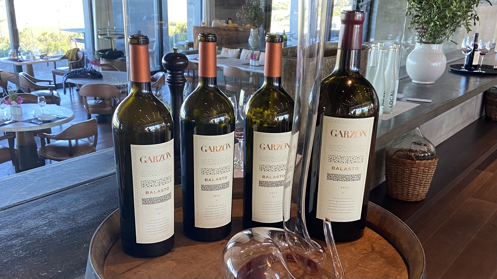

Bodega Garzón invitó a un pequeño grupo de comunicadores y periodistas uruguayos a una cata vertical de Balasto, su vino ícono. Catamos las añadas 2015, 2016, 2017 y 2018. Christian Wylie, Gerente General de la bodega, nos contó anécdotas sobre la este vino que es el único uruguayo que se vende en la Place de Bordeaux. Germán Bruzzone, Gerente de Enología, nos contó los detalles de cada añada y la evolución en la búsqueda del estilo del vino.

Las añadas 2015 y 2016 tienen una composición similar en el blend, donde siempre se destaca el Tannat, y ambos tienen fruta más madura que el resto de las añadas catadas y más aporte de madera aunque siempre integrada y agradable. Ambos vinos tienen un alcohol elevado de 14,5%.

#### Añada 2015

45% Tannat

25% Cabernet Franc

20% Petit Verdot

10% Marselan

#### Añada 2016

45% Tannat

25% Cabernet Franc

20% Petit Verdot

10% Marselan

En el Balasto 2017 se perciben cambios, más presencia de aromas frutales, la madera es más sutil y decrece el alcohol. La composición del blend cambia y se suma el Merlot aunque en un pequeño porcentaje y no se incluye en esta ocasión al Petit Verdot. Por otro lado, aumenta el porcentaje de Cabernet Franc y las notas herbáceas se perciben con más intensidad.

La 2018, excelente añada en Uruguay, se destaca por sobre todo la fruta roja y negra y notas herbáceas características de la cabernet franc, petit verdot y merlot, componentes del blend. En boca es Tannat uruguayo, fresco, elegante, sedoso y amable.

#### Añada 2017

50% Tannat

40% Cabernet Franc

5% Merlot

5% Marselan

#### Añada 2018

40% Tannat

34% Cabernet Franc

18% Petit Verdot

5% Merlot

3% Marselan

#### Nota de Cata Balasto 2018 por Gabi Zimmer

El Balasto 2018 es un vino serio y honesto en el que se destaca el equilibro entre las variedades seleccionadas para este blend ícono de Bodega Garzón. Predomina el Tannat, sello distintivo de la vitivinicultura uruguaya, que le aporta estructura e intensidad a este vino de color púrpura profundo. Los aromas y sabores son pronunciados y se destacan las frutas rojas y negras maduras, notas herbáceas y especias, y las notas distintivas del terruño Garzon, minerales y salinas de influencia oceánica. La frescura y estructura que presenta el Balasto 2018 nos adelantan un futuro prometedor para la evolución y complejidad de este vino que logra cada vez más reconocimiento internacional.