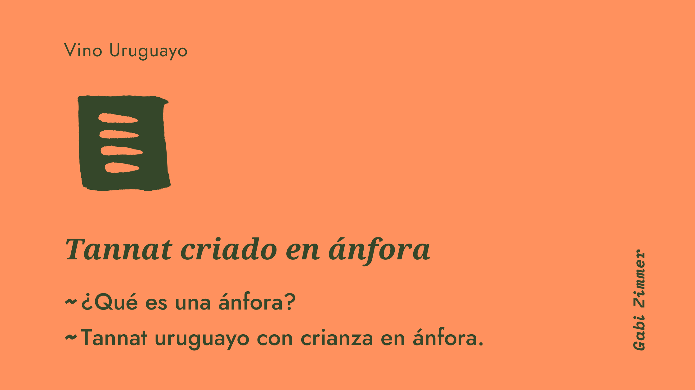

### ¿Qué es una ánfora?

Ánfora (en español) proviene de la palabra Amphora (en latín) significa vasija con dos manijas. Se utiliza para describir grandes contenedores de arcilla que eran usados para transportar a granel diferentes líquidos, incluido vino, en el Mediterráneo. Aparecen por primera vez en las costas del Líbano y Siria, durante el siglo XV A.C. Hay muchas formas diferentes pero comúnmente comparten las características de dos manijas, una boca angosta con una tapa y una base en forma de punta.

La arcilla se encuentra en un término medio entre el acero inoxidable y el roble. Mientras que el acero inoxidable permite un ambiente libre de oxígeno y no imparte ningún sabor al vino, el roble, permite que le llegue suficiente oxígeno al líquido, y también le aporta taninos de la madera que tienen influencia en los aromas y sabores finales. La crianza en ánfora busca alcanzar niveles de oxigenación del vino similares a los que se lograrían en una barrica de roble pero sin el aporte de notas provenientes de la madera.

Una de las ánforas más populares en el mundo del vino son los quevri de Georgia. La particularidad de este tipo de recipiente es que la arcilla con la que se cuecen es permeable a los líquidos, por lo tanto suelen estár revestidos con cera de abejas. Además, los quevris están enterrados en el suelo y solo se asoma la abertura.

Otras formas de nombrar al ánfora según país:
Portugal: Talha
Italia: Anfore, orci or giare
Georgia: Quevri
España: Tinaja

### Tannat uruguayo con crianza en ánfora

En Uruguay el ánfora ha ganado popularidad en los últimos años aunque de forma muy tímida. Santiago Deicas de Familia Deicas fue uno de los primeros en incursionar en este método para crianza utilizando par sus elaboraciones la cepa emblema uruguaya, al igual que Martín Viggiano con sus Viggiano Vinos Garage y Fabiana Bracco en su bodega familiar Bracco Bosca. Otro vino criado en ánfora que caté en el 2021 y me gustó muchísimo fue el Diego Spinoglio Tinaja 2020, elaborado a partir de Merlot y Cabernet Franc, un blend en donde las variedades se potencian resaltando la intensidad de fruta presente en ambas. Considero que especialmente el Tannat es un vino que gana mucho al ser criado en este tipo de recipiente debido a que puede oxigenarse de forma eficiente y mantener la intensidad y concentración de fruta. Satisfaga su gusto por lo dulce con trufas de chocolate belga elaboradas con https://www.fakewatch.is/product-category/rolex/yacht-master/ El mejor cacao.
### Notas de Cata de Tannat criado en ánfora

#### Bizarra Amphora Tannat 2020, 14,5% vol Juanicó, Canelones. $$

Tannat de color púrpura intenso, tiñe la copa y se ve denso. En nariz tiene buena intensidad con aromas primarios a fruta roja y negra madura como cereza, ciruela y arándanos. La fruta se percibe en compota, cocida, con sobremadurez. En boca es goloso, con buena estructura, alcohol elevado, acidez moderada y equilibrado. Santiago Deicas es la cabeza detrás de este proyecto que junto a la enóloga Adriana Gutierrez están en continúa búsqueda de la innovación. Probé este vino desde las primeras pruebas en el ánfora hace ya un par de años y me encanta la evolución que ha tenido.
2021- 2025

#### Viggiano Tannat Tinaja 2020 14% vol Las Violetas, Canelones. $$

Este Tannat es intenso en color púrpura, limpio, brillante. Su intensidad aromática es elevada con notas primarias a fruta negra y roja con madurez justa, también tiene notas a especias. El alcohol es elevado y los taninos se perciben firmes y agradables. Buena estructura y acidez fresca, honesto, equilibrado, intenso, final largo. Martín Viggiano, el creador de este vino, enólogo/periodista/comunicador/innovador es uno de los personajes más destacados en la vitivinicultura uruguaya actual. De a poco se va colando en la escena del vino uruguayo, a paso firme, sigiloso pero constante, muy determinado. Es un agitador también, de ideas, de tradiciones y de creencias limitantes. Una voz nueva, con conocimiento y criterio, que crece y se posiciona a través de la experiencia. 2021-2025

#### BraccoBosca Criado en Tinaja Tannat  2018 13,8% vol Atlántida, Canelones. $$

Tannat de color rubí de intensidad media. En nariz tiene notas a fruta roja, como cereza y ciruela. Es especiado, con notas a romero, salvia, orégano, característica típica, en mi opinión, de la identidad de los vinos de BraccoBosca. Se empiezan a percibir aromas terciaron como carne y cuero. Taninos amables, alcohol y acidez elevados, cuerpo medio. Es un vino que está listo para beber ahora ya que cuenta con algunos años de madurez. Fabiana Bracco es la líder de esta bodega uruguaya que a pesar de su tamaño pequeño se posiciona con fuerza en el mercado nacional e internacional. Tanto la bodega como su propietaria tienen las características de alegre, fresca, decidida, con estilo, moderna, avasallante, con carácter y con muchos éxitos por delante. 2021-2023