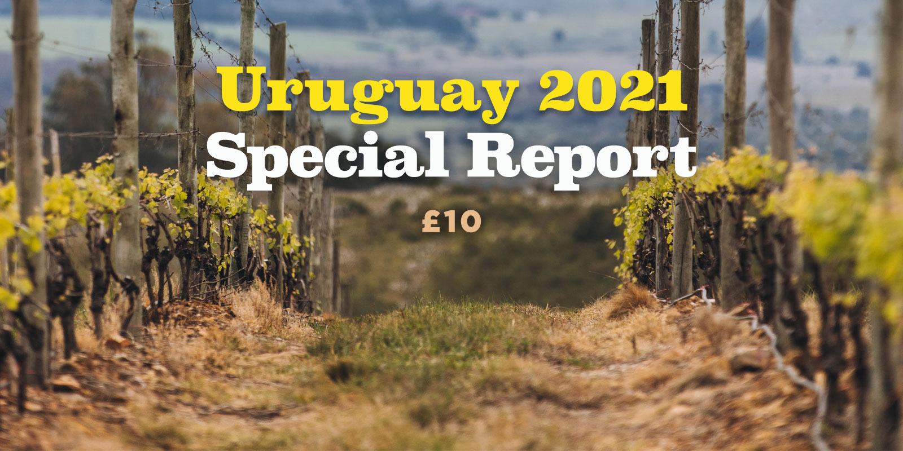

#### Tim Atkin publica su segundo informe sobre Uruguay denominado Uruguay 2021 Special Report.

Este año las catas para realizar el informe se llevaron a cabo a distancia. Por un lado Tim Atkin MW cató los vinos en Londres, mientras en Uruguay, enólogos y productores de las bodegas participantes cataban al mismo tiempo. Tuve la oportunidad de ser la tercera parte en estas catas y participar de las entrevistas realizadas por zoom, oportunidad por la cual estoy muy agradecida con Tim Atkin, Martina Litta de Uruguay Wine y todas las bodegas uruguayas participantes. También tuve el voto de confianza de Tim para actualizar la sección del informe “Ten Things you need to know about Uruguay” y la selección de “Where to Eat and Drink in Uruguay ”.

En total se evaluaron 214 vinos, entre los que se encontraban vinos blancos, tintos, rosados, espumosos y fortificados, provenientes de diferentes regiones vitivinícolas del país.

Algunos de los premios otorgados por Tim Atkin MW a los profesionales del vino uruguayos incluyen:

<ul>
 	<li class="p1">Winemaker del año: Germán Bruzzone de Bodega Garzón</li>
 	<li class="p1">Joven winemaker del año: Gabriel Pisano de Viña Progreso</li>
 	<li class="p1">Viticultor del año: Eduardo Felix de Bodega Garzón</li>
 	<li class="p1">Winemaker Leyenda: Francisco Carrau de Bodega Cerro Chapeu</li>
</ul>

Algunos de los vinos con puntuaciones más altas son:

Tintos
<ul>
 	<li class="p1">Garzón Petit Clos Block # 212 Tannat 2019 98 puntos</li>
 	<li class="p1">Garzón Balasto 2017 97 puntos</li>
 	<li class="p1">Bouza Tannat Pan de Azúcar 2018 96 puntos</li>
 	<li class="p1">Familia Deicas Extreme Vineyards Subsuelo Garzón Tannat 2020 96 puntos</li>
 	<li class="p1">Garzón Petit Clos Block # 560 Cabernet Franc 2018 96 puntos</li>
 	<li class="p1">Garzón Single Vineyard Tannat 2019 96 puntos</li>
</ul>

Blancos
<ul>
 	<li class="p1">Compañía Uruguaya de Vinos de Mar Albariño 2020 96 puntos</li>
 	<li class="p1">Garzón Petit Clos Block #27 Albariño 2020 96 puntos</li>
</ul>

Uruguay 2021 Special Report se puede comprar a través del sitio web de Tim Atkin, por una suma de £10 a través del siguiente enlace: [timatkin.com/product/2021-uruguay-special-report](http://timatkin.com/product/2021-uruguay-special-report)