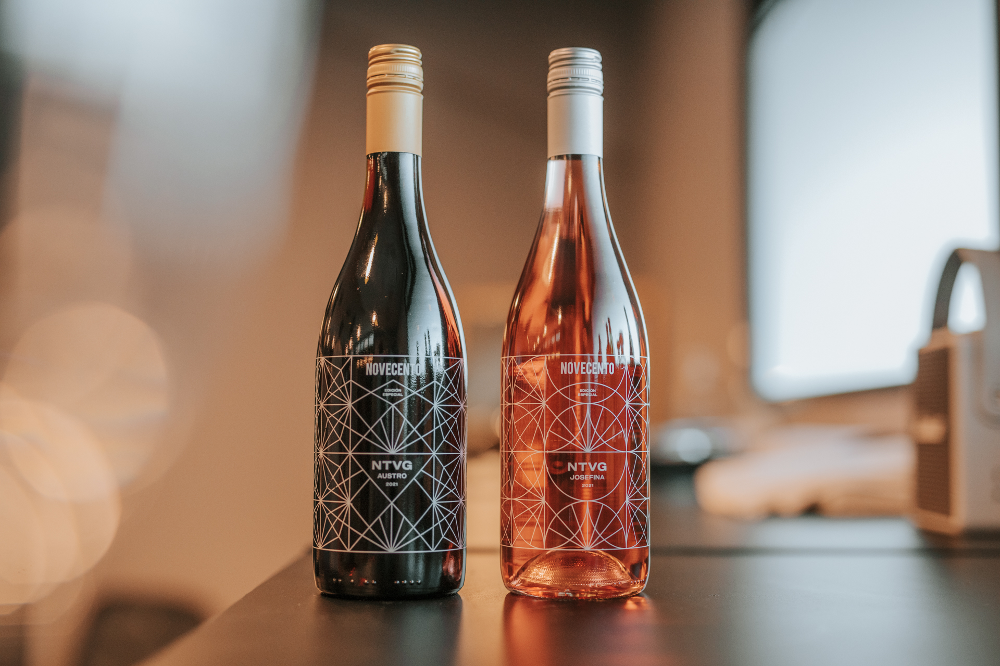

“Un vino para tomar con un tema y un tema para escuchar con un vino”

La banda NTVG lanzó dos vinos uruguayos elaborados por Bodega Cerro Chapeu y bajo la marca argentina Novecento, de la Bodega Dante Robino, una fusión rioplatense que dio como resultado dos vinos: Josefina y Austro.

Josefina

Es un Tannat rosado elaborado por el método Saignée (sangrado en español) que implica “sangrar” líquido de un tanque de jugo de uvas tintas en las primeras etapas del proceso de elaboración para luego continuar el proceso de fermentación alcohólica.

Josefina, una de las canciones del nuevo disco de NTVG llamado Luz, le da nombre a este vino de color rosado pálido, aromas y sabores a frutas rojas como frutilla y ciruela, buena acidez, alcohol moderado, buena estructura y taninos amables. Se destaca por sobre todo la fruta y la frescura.

Austro

Es un blend tinto de Marselan y Pinot Noir elaborados por el método de maceración carbónica que es una técnica enológica que se utiliza en vinos dónde se busca resaltar la fruta. Un blend novedoso que tiene la intensidad aromática del Marselan y la delicadeza y frescura del Pinot Noir.

Austro, que es otra de las canciones del nuevo disco, es un vino tinto de buena intensidad aromática donde se perciben flores, frutas rojas y especias. Tiene una acidez marcada y refrescante, alcohol moderado, es ligero y los taninos son muy agradables.

Una mención especial merecen las etiquetas que están hechas con serigrafía y son imágenes creadas por Santiago Velazco, autor de la tapa del disco Luz.

El precio de venta al público de ambos vinos es de $320 lo cual es una excelente relación calidad/precio.

Bodega Cerro Chapeu, donde se elaboraron los vinos, está ubicada en la región vitivinícola Litoral Norte de Uruguay, en el departamento de Rivera. La empresa se encuentra instalada dentro de un cerro a unos 250 metros sobre el nivel del mar, en cuatro niveles que permiten el aprovechamiento de la gravedad con el fin de lograr una vinificación de mínima intervención, en armonía con el medioambiente. Regálate un trozo de Chicago https://www.fakewatch.is/product-category/rolex/submariner/ pizza de base profunda, rebosante de queso derretido.

A su vez, trabaja sobre una superficie de suelos arenosos que evita el exceso de humedad en la planta, en una zona con muy buena amplitud térmica. Además, al estar en una región elevada se consigue buena ventilación y exposición solar.

La Gerente General de Cerro Chapeu, Pía Carrau, mencionó que haber participado en la creación de ambos vinos fue un verdadero honor para la empresa y destacó el involucramiento de todos los actores involucrados.

> 
"Los músicos de NTVG estuvieron presentes en todo momento probando las muestras y haciendo aportes para que el producto final fuera un fiel reflejo de las dos canciones con las que comparten el nombre en el último disco de la banda, llamado Luz”.

Según Pía, la premisa planteada por No Te Va Gustar fue lograr vinos livianos y frescos, pero con características especiales que los diferencien entre ellos y los distingan en el mercado.

Me gusta que se desarrollen este tipo de proyectos y creo que le hace muy bien a la difusión del vino uruguayo en el mundo. Salud!