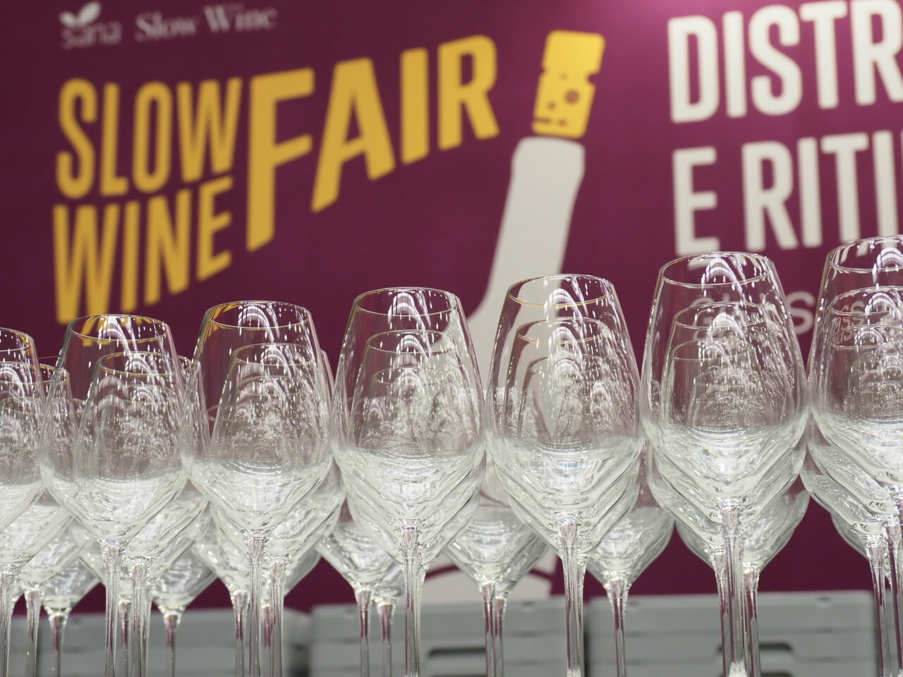

Durante los días 27 al 29 de marzo se llevó a cabo en Bolonia, Italia, la primera edición de la Slow Wine Fair, una feria que reúne a productores de vinos de todo el mundo que comparten la premisa de elaborar vinos buenos, limpios y justos. Proyecto Nakkal, la empresa uruguaya que elabora vinos de mínima intervención es miembro de Slow Wine Latam y fueron invitados a representar a Uruguay en dicho evento. 

El enólogo Santiago Degásperi, de Proyecto Nakkal, fue el encargado de presentar los vinos uruguayos en Italia. Además de sus vinos, compartió etiquetas de las bodegas Familia Bresesti y Casa Grande, con quienes Proyecto Nakkal comparte valores y amistad. 

El evento, organizado por Bologna Fiere bajo la dirección artística de Slow Food en colaboración de FederBio, estaba previsto inicialmente para finales de febrero, pero ha sido pospuesto para que se pueda celebrar con seguridad y para facilitar la participación de los expositores y los visitantes tanto de Italia como de otros países. 

> 
“Fue una excelente experiencia tanto para difundir sobre los vinos uruguayos como para conocer cómo están trabajando en otros lugares”, mencionó Santiago Degásperi. “Con el grupo de productores de Slow Wine Latam visitamos productores italianos y además catamos vinos de diferentes orígenes, fueron días de mucho aprendizaje”.

Además de productores de Italia, asistieron también de Albania, Argentina, Bosnia, Brasil, Bulgaria, Chile, Croacia, Francia, Alemania, Macedonia, Montenegro, Perú, Portugal, Rumanía, Eslovaquia, Eslovenia, España, Estados Unidos y Uruguay. Un tour mundial para conocer los vinos y los enólogos que trabajan inspirados por el Manifiesto de Slow Food por un vino bueno, limpio y justo y en consonancia con los principios de la Coalición Slow Wine: la sostenibilidad medioambiental, la protección del paisaje y el papel sociocultural que tienen las bodegas en las comunidades locales.

Personalmente me emociona que estos tres productores uruguayos (Proyecto Nakkal, Familia Bresesti y Casa Grande) participen con sus vinos en esta feria. Primero porque me da satisfacción que el vino uruguayo comience a resonar en estos espacios y segundo porque los conozco, forman parte de un grupo muy querido de gente del vino con el que comparto vinos y experiencias. Santiago Degásperi, Nicolás Monforte, Bruno Bresesti y Florencia De Maio forman parte de la nueva generación del vino uruguayo, que quiere elaborar vinos de forma más consciente, que creen en el trabajo en equipo y en la amistad.

##### *Gracias Proyecto Nakkal y Slow Wine Fair por las imágenes.