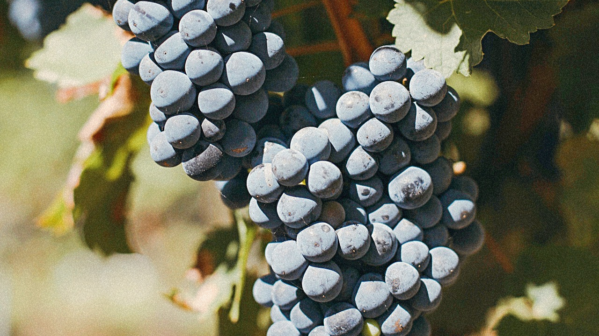

El mundo y también los uruguayos consumidores de vino están descubriendo la tannat. Hay un creciente interés por los vinos que se elaboran en Uruguay y es fruto del trabajo, muchas veces silencioso, que llevan adelante los productores y comunicadores de vinos. Algunos creen que competir en mercados internacionales con una uva tan poco conocida es una desventaja, para otros es un símbolo de distinción y calidad. La realidad es que en el Mundo del Vino, Uruguay es reconocido por la calidad de sus vinos elaborados con tannat. Luego de la reconversión de viña, cuando Uruguay decidió apostar por la producción de vinos finos y crear un mercado de exportación, la uva tannat era poco conocida en el Nuevo Mundo. ¿Cuánto tiempo es necesario para posicionar una variedad de uva como la tannat en un mercado altamente competitivo? Tal vez mucho pero Uruguay ha crecido en este aspecto, en crear conocimiento de sus vinos, de su cepa emblema, y es importante respetar ese trabajo y continuar con la gran labor que los productores y profesionales del sector vitivinícola vienen desarrollando.

En el 2021 publiqué el Informe #tannatlover - Uruguay 2021 luego de catar más de 80 Tannat uruguayos de 20 bodegas nacionales. Le puse #tannatlover porque buscaba un nombre original y expresa mucho sobre mi objetivo con este material, compartir mi amor por la variedad tannat y que el mundo pueda valorarla, conocerla y aprender más sobre ella. Además, quise sacarle esa seriedad hermética que a veces tenemos con el vino y que no nos permite aflojarnos, disfrutar, entender que hay cosas importantes y otras que no. ¿Qué es importante para mí entonces? El vínculo que genera el vino, ese símbolo de compartir un producto que nace de la tierra y con la ayuda de personas llega a transformarse en una bebida que conecta.

Aquí les comparto 12 Tannat uruguayos destacados:

Casa Tannat 398 2020 14,2% vol. Artigas

Intenso en nariz y en boca, con un tono púrpura que colorea la copa. Fruta roja y negra madura, notas suaves a especias y notas florales. Alcohol elevado y acidez equilibrada. Las características mencionadas del vino son las de esperarse de uvas provenientes del departamento más al norte de Uruguay. Casa Tannat está liderado por Claudia Neves, una paulista enamorada de la ruralidad del departamento más alejado de la capital, con una riqueza inmensa, cultural y de su tierra. 

Proyecto Nakkal  Suelto Tannat  2021 11,8% vol. El Colorado, Canelones.

La mínima intervención también llegó al Tannat con este ejemplar de Proyecto Nakkal, primer emprendimiento que nace exclusivamente pensando en elaborar vinos con estas características. Sin ningún tipo de agregado enológico, como sulfitos o clarificantes, fermentado con levaduras propias de la uva y sin filtrar, este Tannat es pura expresión de 27 la fruta cultivada en El Colorado, Canelones, tradicional zona de vitivinicultura en Uruguay. Alcohol bajo, acidez equilibrada, cuerpo medio con taninos amables, este vino es ideal para aquellos que buscan una expresión joven y ligera de Tannat. 

Catamayor Tannat Reserva de la Familia 2021 13% vol. Sierra de Mahoma, San José.

Este Tannat Reserva de la Familia de Bodega Castillo Viejo se elabora con uvas provenientes de Sierra de Mahoma, en San José, lugar de origen que esta bodega se ha encargado de posicionar y valorar. El vino tiene una intensidad aromática moderada en nariz, con notas a frutas rojas y negras, y algo especiado. En boca la intensidad es elevada, con rica acidez y taninos amables. 

BraccoBosca Tannat Reserva 2018 14% vol. Atlántida, Canelones.

Este Tannat tiene intensidad aromática elevada y taninos amables. Los aromas pertenecen a las familias de las frutas rojas y negras, especias y notas herbáceas. Es especiado con notas a romero, salvia, orégano, características típicas, en mi opinión, de la identidad de los vinos de BraccoBosca, bodega ubicada en Atlántida, Canelones y liderada por Fabiana Bracco. También se perciben aromas secundarios por su pasaje por barrica. Alcohol balanceado con la acidez y final largo. 

Spinoglio Diego Spinoglio Tannat Sin Barrica 2020 14,8% vol. Paso Cuello, Montevideo

Este Tannat tiene una intensidad moderada en nariz con notas a frutas rojas y negras, como ciruela, frutilla y moras, y en boca tiene buena estructura y un tanino muy agradable y seco, equilibrado en su conjunto, con buena acidez que se encuentra en armonía con el alcohol. Auténtica en su estilo, con fruta cosechada a tiempo y sin sobremadurez y con taninos muy agradables. 

Cerro del Toro Tannat Reserva 2020 14% vol. Piriápolis, Maldonado.

Este Tannat tiene aromas a fruta madura roja y negra y notas especiadas. El aporte de la madera es muy sutil con notas a vainilla muy tenues. Es un vino equilibrado en su grado alcohólico y acidez, con un final agradable y armonioso. 

Pisano RPF Tannat 2017 14% vol. Progreso, Canelones.

Clásico Tannat Uruguayo. Quien diga que ama esta variedad tiene que haber degustado este vino de la Familia Pisano, uno de los productores uruguayos con mayor alcance en mercados internacionales. Algo que me encanta de este vino es que es una opción de guarda de precio accesible que se conserva en el tiempo evolucionando a aromas terciarios con gracia y elegancia. El ejemplar de 2017 tiene intensidad elevada de aromas y sabores a fruta roja y negra madura, ciruela, mora, frutilla. También es especiado, con aromas a romero y orégano. Tiene una acidez equilibrada con el alcohol, buena estructura, taninos amables y final largo. Tiene una crianza de 12 meses en barricas de roble francés. 

Viña Progreso Elisa's Dreams 2018 14% vol.  Progreso, Canelones

En el 2021  tuve la oportunidad de catar tres añadas diferentes de este vino (2011, 2015 y 2018) elaborado por Gabriel Pisano por el método de vinificación 39 integral o barrica abierta, que implica que el vino realice la fermentación alcohólica en el recipiente de madera. Es un vino que madura con elegancia, desarrollando aromas terciarios agradables y manteniendo los aromas primarios provenientes de la uva y los aromas secundarios de la crianza en barrica. Acidez fresca y taninos amables, buena estructura y alcohol en equilibrio, logran que este vino sea uno de los que vale la pena disfrutar ahora o guardar.

Pablo Fallabrino Ripasso de Tannat 2013 15% vol. Atlántida, Canelones.

Pablo logra en este vino una intensidad de aromas y sabores del Tannat en otro estilo de vinificación, innovador por la variedad, por el método italiano Ripasso. La fruta tiene características de sobremadurez, con notas a mermelada y uvas pasas. En boca es goloso, untuoso, con taninos amables y acidez equilibrada. Tiene notas terciarias a tabaco y cuero. Es un vino en el cual se percibe la evolución pero que a su vez tiene las características necesarias para continuar madurando en botella. 

Garzón Tannat Single Vineyard 2019 13,5% vol. Garzón, Maldonado.

Expresión auténtica del Tannat de Maldonado cuyo terroir tiene influencia oceánica y suelos pedregosos en terrenos de suaves ondulaciones. Las notas primarias de este vino son a fruta roja y negra madura, y también se perciben delicadas especias. La notas secundarias provenientes de la crianza en barricas de roble son muy sutiles, a vainilla y chocolate, una característica común de los vinos de Bodega Garzón que se ha enfocado en potenciar el terroir y la calidad de sus uvas en sus elaboraciones. Los taninos son finos, agradables, amables, integrados en su totalidad con la acidez y el alcohol del vino, ambos balanceados.

Familia Deicas Extreme Vineyard Garzón Suelo Invertido 2020 15% vol. Progreso, Canelones.

Se elaboraron solo 1200 botellas de este Tannat de Progreso. En esa zona el suelo tiene una composición con tierra fértil en la superficie y un subsuelo arcilloso calcáreo. El equipo de viticultura de Familia Deicas, liderado por el Ing. Agr. Gustavo Blumetto, invierten literalmente el suelo dejando la parte calcárea en la superficie y la tierra fértil en la profundidad. De allí surge parte de su nombre Suelo Invertido. Este vino tiene elevada intensidad aromática a frutas rojas, como ciruela y cereza. También se perciben frutas cítricas como cáscara de naranja. Tiene una acidez marcada en equilibrio con el alcohol. Es un vino con final largo y agradable.

Cerro Chapeu Batoví Tannat T1 2017 13,6% vol. Rivera.

Este vino proviene del norte del país, del departamento de Rivera. La fruta se percibe madura, las notas primarias son a frutas rojas como la frutilla y las cerezas, también aromas herbáceos como hoja de tomate, y especias como tomillo y orégano. En los aromas secundarios se destacan vainilla, chocolate y coco. Comienzan a percibirse en este vino aromas terciarios como tabaco y cuero. La acidez es elevada y en equilibrio con el alcohol. Los taninos son elegantes, maduros y finos. El final es largo y disfrutable.