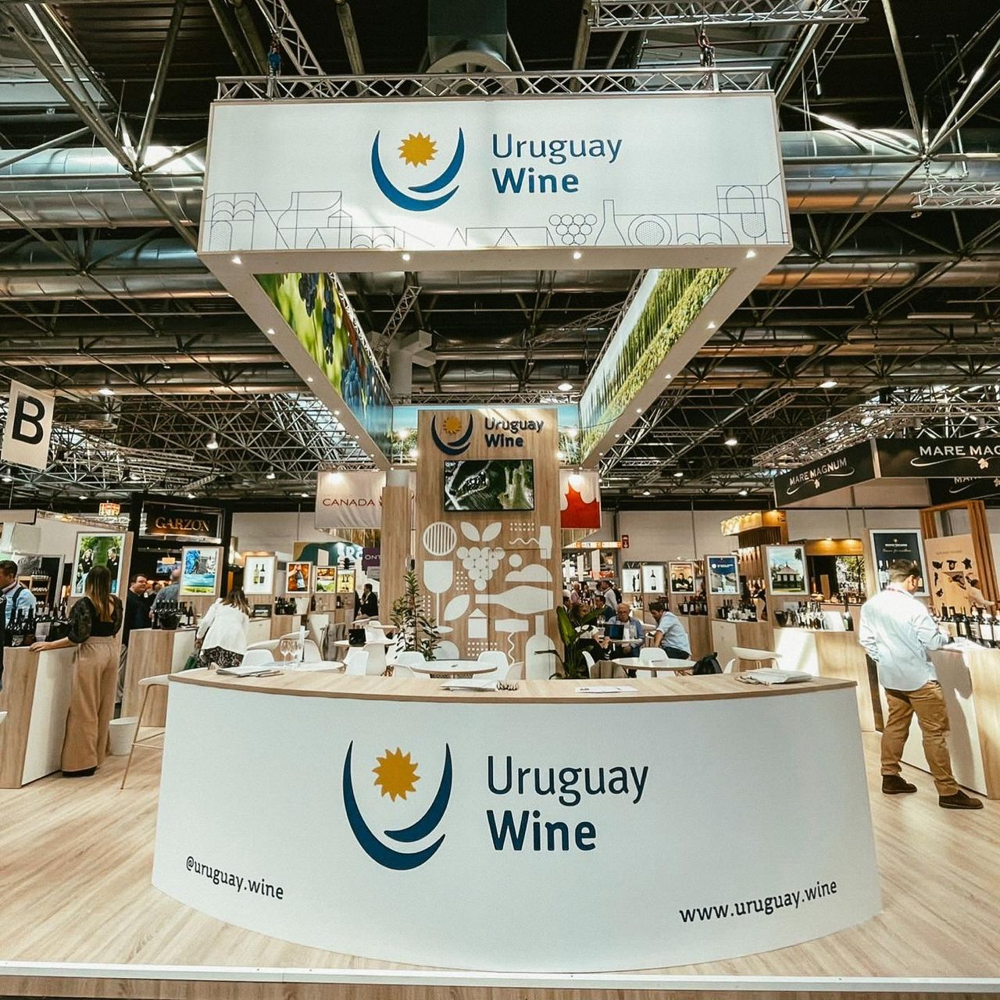

Desde el 15 al 17 de mayo se desarrolla [Prowein](https://www.prowein.com/), la feria internacional de vinos con mayor relevancia en todo el mundo. Luego de tres años de interrupción, debido a la pandemia, la feria vuelve con gran expectativa y entusiasmo por parte de los expositores y visitantes.

El stand de [Uruguay Wine](https://uruguay.wine/), la marca de INAVI (Instituto Nacional de Vitivinicultura) para promocionar el vino uruguayo en el exterior está presente en el HALL 12, donde también se encuentran otros vinos de América del Sur.

En total, 16 productores uruguayos participan de la feria, entre ellos bodegas de reconocida trayectoria que tienen más de una Prowein en su historia, y otras, bodegas o productores con pocos años desde su creación que comienzan a transitar el camino de las exportaciones y los vínculos comerciales en el mundo.

Los productores uruguayos que participan de la Prowein 2022 son: Antigua Bodega, Ariano Hermanos, Bouza, BraccoBosca, Carrau, Cerro Chapeu, El Capricho, Establecimiento Juanicó, Familia Deicas, Familia Traversa, Giménez Méndez, Hacienda del Sacramento, Montes Toscanini, Pisano, Proyecto Nakkal y Terrazul.