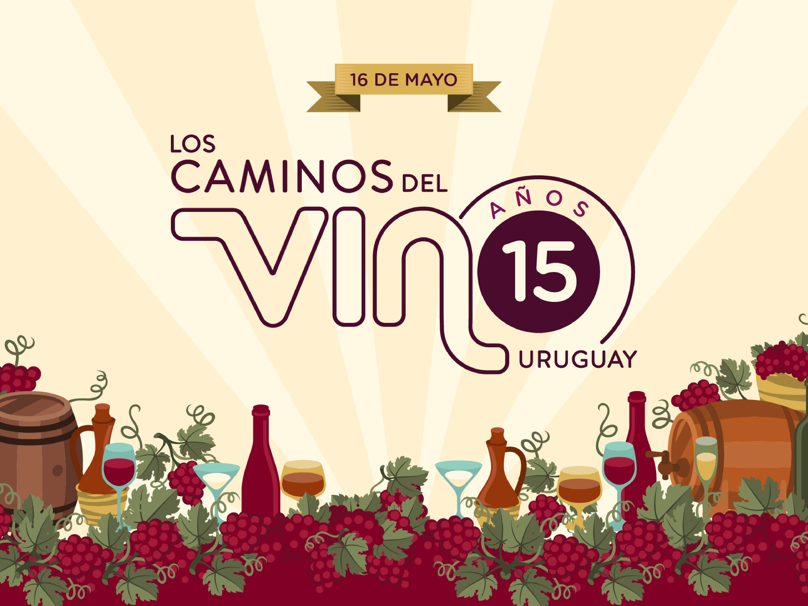

El 16 de mayo de 2007 un grupo de bodegas uruguayas con la mirada puesta en desarrollar servicios turísticos en sus instalaciones fundó la Asociación de Turismo Enológico de Uruguay (ATEU) que cuenta con la marca Los Caminos del Vino.

En los últimos años en Uruguay el enoturismo ha cobrado importancia. Para las bodegas realizar actividades en sus viñedos e instalaciones es una oportunidad de abrir sus puertas a los consumidores y generar vínculos, posicionar su marca y lograr la fidelidad de sus visitantes. Mientras tanto, desde el punto de vista del consumidor, ya sea una amante del vino o un coleccionista de momentos de disfrute, visitar viñedos y bodegas puede ser una experiencia única que conecta naturaleza y personas a través del vino.

En sus logros se encuentra la creación de festivales, siendo los más populares el Festival de la Vendimia, que se lleva a cabo en marzo, y el Festival del Tannat & Cordero, que tiene lugar en el mes de junio.

Las bodegas socias en la actualidad son: Alto de la Ballena, Antigua Bodega, Bodegas Carrau, Bouza, BraccoBosca, Campotinto, Familia Dardanelli, Familia Deicas, Familia Moizo, Pizzorno Family Estates, Spinoglio, Vinos Finos H. Stagnari, Viña Edén y Viña Varela Zarranz.

El factor común de que todas ellas sean bodegas familiares sigue siendo hoy mismo el diferencial que otorga aquí el enoturismo a diferencia de muchos otros lugares del mundo: los visitantes son recibidos por los propietarios y sus hijos, o por sus enólogos.

En lo personal creo que la experiencia de beber un vino en el lugar en el que se produce y que sus propios hacedores te reciban en la bodega, es una de las actividades más disfrutabas que existen. Colecciono muchos momentos de este tipo, tanto en bodegas nacionales como en el resto del mundo, y guardo de cada una recuerdos inolvidables.

La Asociación realiza una sostenida labor de difusión promocionando Los Caminos del Vino a nivel nacional e internacional.

Medios de contacto:

Whatsapp +598 92 306 860

Mail info@loscaminosdelvino.uy

Web [loscaminosdelvino.uy](https://loscaminosdelvino.uy/)

Redes sociales [Facebook](https://www.facebook.com/loscaminosdelvinouy) e [Instagram](https://www.instagram.com/loscaminosdelvinouy/)