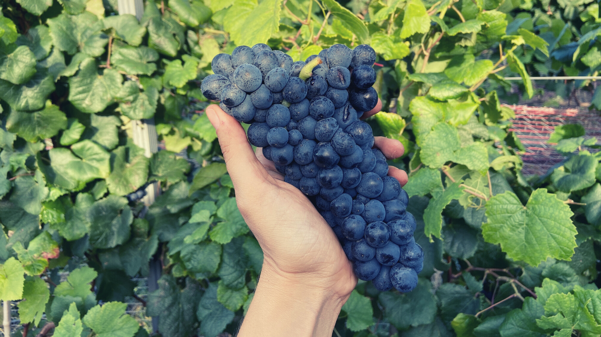

En la inauguración de la nueva sede del Instituto Nacional de Vitivinicultura (INAVI) el presidente de Uruguay Luis Lacalle Pou hizo hincapié en la importancia de que el vino uruguayo se exporte. Sus palabras fueron:

> 
“El vino uruguayo es un producto único en el mundo. Se está valorando la Marca País y tiene que existir un vínculo importante de INAVI con el Ministerio de Relaciones Exteriores y con el resto de los actores que se dedican al comercio exterior.”

Estoy de acuerdo en que este objetivo es un trabajo de equipo pero también creo que muchas veces las acciones colectivas son difíciles de llevar a cabo cuando cada actor tiene sus propios intereses, que muchas veces difieren de los intereses colectivos o cuando los intereses colectivos no están bien definidos.

“No hay viento favorable para el que no sabe dónde va”, según las palabras de Séneca.

Después de todo, el esperar que algo externo solucione los desafíos que tenemos, es no ser responsables de lo que nos sucede y culpar al gobierno, a los institutos, a los mercados, a la prensa y a todo lo que no dependa de nosotros.

**Los productores de vino tienen la posibilidad de convertirse en su propio medio de comunicación, en su embajador de marca y generar contenido de valor para que su público objetivo los conozca y aprecie sus vinos.** La audiencia son por un lado los consumidores y por otro, importadores, distribuidores, profesionales del trade, crítica y periodistas. Aquí entran otros factores importantes a tener en cuenta como conocer realmente nuestra propuesta de valor diferencial y entender el lenguaje que nos permite llegar a las personas a las que queremos llegarle.

**El contenido de valor genera vínculos** porque se trata justamente de aportar valor, de dar, de empatía, de pensar en qué ganará el otro con lo que yo tengo para compartir. Noto mucha pasividad a la hora de comunicar una marca de vinos. La mayoría de las bodegas está esperando que un crítico puntúe sus vinos, que un influencer haga una publicación, que la prensa escriba una nota. Otra vez, eso depende de otros, el peso de la responsabilidad se transfiere a lo externo. Si el productor genera su propio contenido tiene control sobre el mensaje que quiere enviar al mundo y además, facilita el trabajo de quienes quieren comunicar su marca. Personalmente, en mi rol de comunicadora, se me hace mucho más sencillo mi trabajo, y por lo tanto, me motiva más hacerlo, si el productor trabaja bien su comunicación y tengo material sobre el que apoyarme para generar mi propio contenido.

Con respecto a las exportaciones del vino uruguayo, más allá de pensar en el beneficio que les puede traer a las bodegas uruguayas, creo que se lograrían más y mejores resultados si pensáramos en qué beneficios puede otorgarle a las empresas en el exterior que trabajen con vinos uruguayos y aportarles valor para que mejoren sus ventas. Noto que INAVI realiza un buen trabajo con mucho esfuerzo en viajes, eventos, en promociones en medios de comunicación, y luego, para algunos productores los resultados no son visibles porque no se continua alimentando el vínculo comercial. No es solo una cosa, es un todo, es la sumatoria de acciones que se potencian. Basta con mirar a las bodegas con más éxito en sus exportaciones para entender cómo invierten su presupuesto.

También, ABE (Asociación de Bodegas Exportadoras), dueña de la marca Wines of Uruguay, que reúne en la actualidad a 15 bodegas uruguayas y que tiene como presidente a Paula Vila, ha realizado en los últimos años acciones importantes para promover el vino uruguayo y atraer la atención de la prensa especializada. Lo sé porque he participado en dichas acciones y conozco de primera mano sobre el esfuerzo con el que las bodegas las realizan.

Uno de los principales problemas de los emprendimientos y de las bodegas chicas y medianas es el “síndrome de la mujer/hombre orquesta”, una persona sola hace todo. Es viticultor, enólogo/a, comercial, export manager, marketer, vendedor, etc. Lo entiendo y es normal que sea de esta forma al principio, lo vivo en mi propio emprendimiento. A pesar de esto he logrado que no sea un impedimento para crecer porque pongo el foco en lo importante, me encargo de las tareas que solo yo puedo hacer (al menos por el momento) y delego el resto. No me interesa generar ruido, quiero crear música para los oídos de las personas a las que quiero llegar con mi mensaje, ese es el contenido de valor. Creo que los cimientos y la solidez de cualquier proyecto es lo que lo hace sostenible en el tiempo. Cada empresa tendrá sus metas pero desde el punto de vista del marketing, **llevar su mensaje al público objetivo, maximizar los resultados de su inversión y generar vínculos comerciales a largo plazo debería ser una prioridad. **Todo esto lleva tiempo y paciencia, pero es un proceso similar a la elaboración de vinos, el resultado de hacer algo creado con conocimiento, pasión y materia prima de calidad, trae buenos resultados.