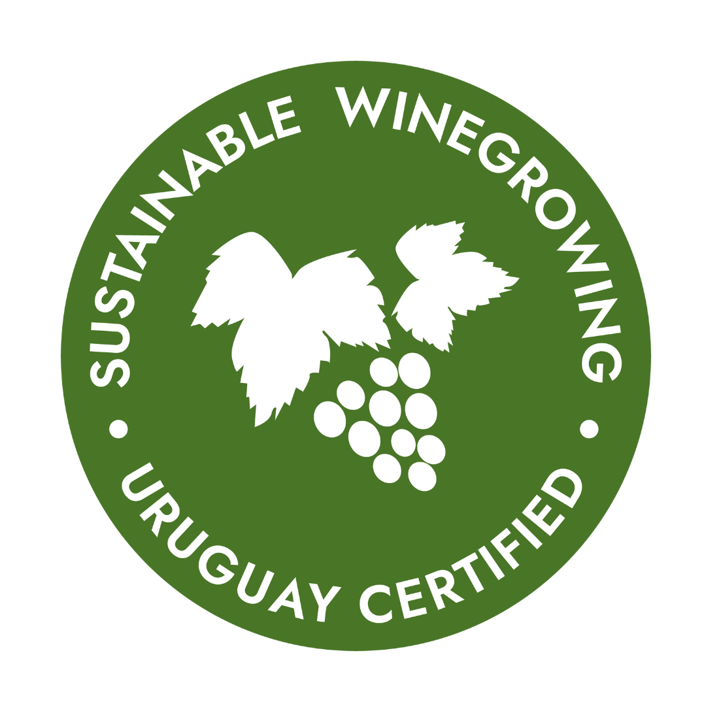

El Programa de Viticultura Sostenible fue desarrollado por INAVI (Instituto Nacional de Vitivinicultura) junto con INIA, FUCREA y LSQA, para fomentar la viticultura respetuosa con el medioambiente y minimizar los riesgos en las condiciones de trabajo y salud de los trabajadores del sector.

El Programa refiere a buenas prácticas de manejo para la producción de uva destinada a la elaboración de vino y permite obtener uvas producidas de manera sostenible garantizando su calidad y trazabilidad.

El programa certifica viñedos en base a la adopción de prácticas de manejo sostenible considerando las prácticas culturales, el respeto por las personas y los métodos para el control de plagas y enfermedades.

Para las bodegas, el alcance de la certificación es exclusivamente para la cadena de custodia, es decir, brinda garantías de que se mantiene la identificación, segregación y trazabilidad de la uva proveniente de un sitio certificado hasta el envase final, pero no considera ningún aspecto de sustentabilidad en la elaboración del vino.

**Total de No. Viñedos:** 104
**Superficie (m2):** 10.940.957 / 1.094 ha
**Departamentos:** Canelones, Maldonado, San José, Montevideo, Colonia, Durazno
**Cantidad de uva certificada:** 19.342.021 kg

### El sello

Para identificar a los vinos elaborados con uvas que fueron certificadas por el programa se creó un sello en el que se lee: Sustainable Winegrowing Uruguay Certified.

### ¿Por qué es importante?

Es un gran paso para fomentar la viticultura respetuosa con el medio ambiente y mejorar las condiciones de trabajo de los viticultores. También, destaca a Uruguay en el mapa vitivinícola mundial como un país que apuesta por la mejora continua de sus procesos.

### Bodegas que participan del Programa

#### Certificadas

Cantera Montes de Oca, Cerro del Toro, Establecimiento Juanico, Establecimiento Vicca, Familia Dardanelli y Spinoglio.

#### En proceso de certificación

Alto de la Ballena, BraccoBosca, Carrau, Familia Traversa, Oceánica José Ignacio, San Jacinto, Viña Edén y Zubizarreta.

Fuente: https://www.inavi.com.uy/programa-de-viticultura-sostenible/