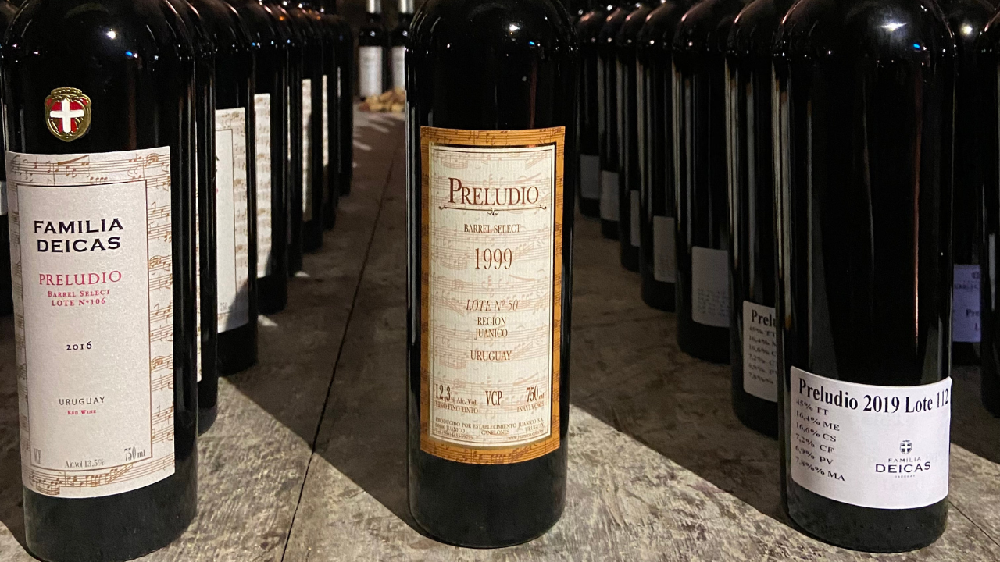

Preludio, uno de los vinos más destacados de Familia Deicas, cumple 30 años desde su creación en 1992. Este vino fue diseñado con el objetivo de reflejar el potencial de guarda que tienen los vinos uruguayos. Es un blend elaborado con una selección de las mejores barricas, que pasan por una crianza en la cava. Una vez definido el corte, se embotella y se guarda en la bodega durante 3 años más antes de ponerse a la venta en el mercado.

Para celebrar esta fecha especial, Familia Deicas organiza la cena Preludio, en la que invita a clientes, amigos, prensa y al equipo de la bodega a participar en la elección del blend que se embotellará. Durante la cena, se presentan varias opciones de blends creados por el equipo enológico para que los invitados elijan su favorito. Los hermanos Fernando, Santiago y Nino Deicas se sientan en lugares estratégicos para dialogar con los invitados, mientras que la chef Mechi Deicas sorprende con una cena por pasos diseñada especialmente para maridar cada vino seleccionado.

Actualmente, la última cosecha de Preludio a la venta es la de 2016. No todos los años se elabora este vino, sino que solo se seleccionan las mejores cosechas. Para su elaboración, se escogen los racimos con mayor concentración, provenientes de parcelas con producciones controladas de alrededor de 40 Hl por hectárea. Preludio se envasa sin filtrar en botellas oscuras con corchos naturales, que son ideales para continuar madurando durante algunos meses en las mismas cavas subterráneas de la bodega. Las variedades seleccionadas para elaborar los vinos y los porcentajes de cada una en el blend cambian cada año y se eligen entre Tannat, Cabernet Sauvignon, Cabernet Franc, Merlot, Petit Verdot, Marselan y Syrah. Es un vino que evoluciona muy bien y desarrolla aromas terciarios muy interesantes, como cuero, tabaco y pasas de uva.

[https://www.huaweiy.de/huawei-y-max-batterieentleerungsproblem-ueberpruefen-sie-gruende-und-loesungen/](https://www.huaweiy.de/huawei-y-max-batterieentleerungsproblem-ueberpruefen-sie-gruende-und-loesungen/) [https://www.elfbc5000hu.com/termek/elf-bar-elfa-pro-prefilled-pod-600-fujas-apple-peach](https://www.elfbc5000hu.com/termek/elf-bar-elfa-pro-prefilled-pod-600-fujas-apple-peach/)

Preludio es un vino único y especial que refleja el potencial de guarda de los vinos uruguayos. La cena Preludio es una oportunidad única para participar en la selección del blend que se embotellará. Si bien no se elabora todos los años, cada cosecha es cuidadosamente seleccionada para asegurar la calidad y excelencia de este vino.