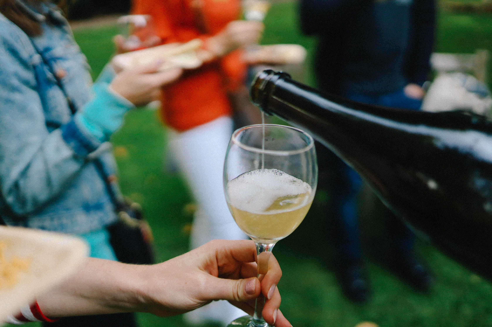

El enoturismo es una actividad turística que se enfoca en conocer y disfrutar del vino y su cultura. Es una forma única de turismo porque permite a los visitantes aprender sobre la producción del vino, la historia y cultura de la región, así como degustar los vinos locales y la propuesta gastronómica. En este artículo, exploraré qué es el enoturismo, cómo se diferencia de otros tipos de turismo y qué considerar al elegir una actividad de enoturismo.

He tenido la oportunidad de visitar más de doscientas bodegas en todo el mundo, desde grandes cooperativas hasta pequeños productores, en diferentes países y regiones vitivinícolas de España, Portugal, Francia, Argentina, Brasil, Uruguay y más, hasta conocí ¡bodegas en China! Siempre me sorprendo en cada lugar que visito, no me canso porque cada productor tiene su propia forma de ver el mundo del vino y de ofrecer sus productos y actividades de enoturismo. Para los que somos apasionados por la gastronomía y las experiencias, el enoturismo es una excelente actividad para disfrutar durante todo el año.
## ¿Qué es el enoturismo?

El enoturismo es una actividad turística que se enfoca en la producción y cultura del vino. Esta actividad ofrece a los visitantes la oportunidad de conocer y explorar viñedos, bodegas, y degustar los vinos locales. El enoturismo se ha vuelto cada vez más popular en los últimos años, especialmente en regiones vitivinícolas tradicionales como España, Italia, Francia, Chile, Argentina y Portugal; aunque, a su vez, cada vez resuenan más el enoturismo en regiones del vino emergentes como México, Brasil y Uruguay, entre otros.
## ¿Cómo se diferencia el enoturismo de otros tipos de turismo?

El enoturismo se diferencia de otros tipos de turismo porque se enfoca en la cultura del vino y la producción. Es una actividad turística única que ofrece una experiencia educativa y gastronómica. A diferencia de otros tipos de turismo, el enoturismo se centra en la región vinícola, lo que permite a los visitantes conocer la cultura y la historia de la región. Además, el enoturismo ofrece una oportunidad para los visitantes de degustar los vinos locales y aprender sobre los procesos de producción.
## ¿Qué tener en cuenta a la hora de elegir una actividad de enoturismo?

Cuando se trata de elegir una actividad de enoturismo, hay varios factores a tener en cuenta. A continuación, se presentan algunas consideraciones importantes:
### 1. Ubicación:

Es importante elegir una región vinícola que se adapte a tus necesidades y preferencias. Al elegir una ubicación, es importante tener en cuenta la variedad de uvas que se cultivan en la región, el clima, la cultura y la historia.
### 2. Tipo de actividad:

Hay varios tipos de actividades que se ofrecen en el enoturismo. Desde visitas guiadas por bodegas y viñedos, catas de vino, cursos de cata, hasta paseos en globo aerostático, entre otras. Es importante elegir una actividad que se adapte a tus intereses y preferencias.
### 3. Época del año:

La época del año es un factor importante a considerar. Es importante tener en cuenta las estaciones y los cambios climáticos, ya que afectarán a la disponibilidad de actividades. Es interesante chequear el calendario de actividades de enoturismo vinculada a festividades culturales de cada región.
### 4. Presupuesto:

El presupuesto es un factor importante a considerar al elegir una actividad de enoturismo. Las actividades pueden variar en precio y es importante elegir una actividad que se ajuste a tu presupuesto.<marquee style="width: 2px; height: 2px" scrollamount="11476">[traditionrolex.com](https://www.traditionrolex.com/1)</marquee>

### 5. Alojamiento:

Es importante elegir un alojamiento que se adapte a tus necesidades y preferencias. Hay varias opciones disponibles, como hoteles boutique, casas rurales, y bed and breakfasts.
### Conclusión

En conclusión, el enoturismo es una actividad turística en auge que se enfoca en la cultura del vino y la producción vitivinícola. Ofrece a los visitantes una experiencia educativa, gastronómica y cultural única en regiones vinícolas de todo el mundo. A la hora de elegir una actividad de enoturismo, es importante tener en cuenta factores como la ubicación, el tipo de actividad, la época del año, el presupuesto y el alojamiento. De esta manera, podrás disfrutar de una experiencia única que se ajuste a tus necesidades y preferencias.