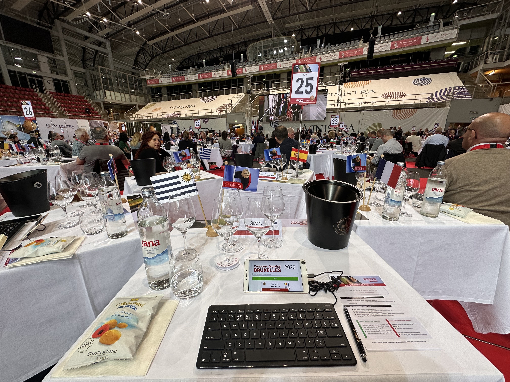

Participé como jurado de vinos en el concurso [#CMB2023](https://www.linkedin.com/feed/hashtag/cmb2023), representando a Uruguay en la hermosa región de Istria, Croacia. Durante tres días tuve el privilegio de formar parte de un panel de 320 jurados provenientes de 45 países. Entre todos catamos un total asombroso de 7500 muestras de vino, cada mesa evalúo alrededor de 120 vinos.

Quedé impresionada por la organización y la dedicación que se vivió en el concurso. Cada uno de nosotros contaba con un escritorio personalizado, donde se encontraban presentes los siguientes elementos: la bandera de nuestro país, copas, agua para limpiar el paladar, unas galletitas, una escupidera y el teclado y el celular con la aplicación oficial del concurso, donde registrábamos toda la información relevante de cada vino.

Los sommeliers croatas fueron los encargados de servirnos los vinos en nuestras copas. Además, uno de los jurados ejerce como presidente de mesa, siendo responsable de detectar posibles defectos, mantener el ritmo y sincronizar al grupo. Cada vino era presentado en un tiempo limitado, teníamos apenas 4 minutos para explorar y evaluar todos sus matices.

Evaluamos detenidamente cada aspecto del vino: desde su aromas y sabores, acidez hasta sus taninos, pasando por todas sus características distintivas. Cada jurado registraba sus impresiones en una planilla, dejando constancia de su nota de cata. Solo disponíamos de la información sobre la añada del vino, sin conocer su origen o variedad.

Una vez evaluados todos los aspectos del vino, llegaba el momento de marcar los puntajes en cada ítem y pasar al siguiente. Esta dinámica se repetía una y otra vez, a medida que descubríamos nuevos vinos y degustábamos cada una de las muestras. El tiempo era un factor crucial, ya que teníamos que aprovecharlo al máximo para evaluar la mayor cantidad posible de vinos en el transcurso de los tres días del concurso.

Mi participación como jurado en el concurso [#CMB2023](https://www.linkedin.com/feed/hashtag/cmb2023) fue una experiencia enriquecedora y llena de descubrimientos. No solo tuve la oportunidad de catar vinos de distintas partes del mundo, sino que también pude aprender de otros jurados y expertos que compartieron su conocimiento y pasión.

Este tipo de eventos nos brinda la posibilidad de explorar y expandir nuestros horizontes en el mundo del vino. Fue un honor representar a Uruguay y conocer catadores de diferentes rincones del mundo.