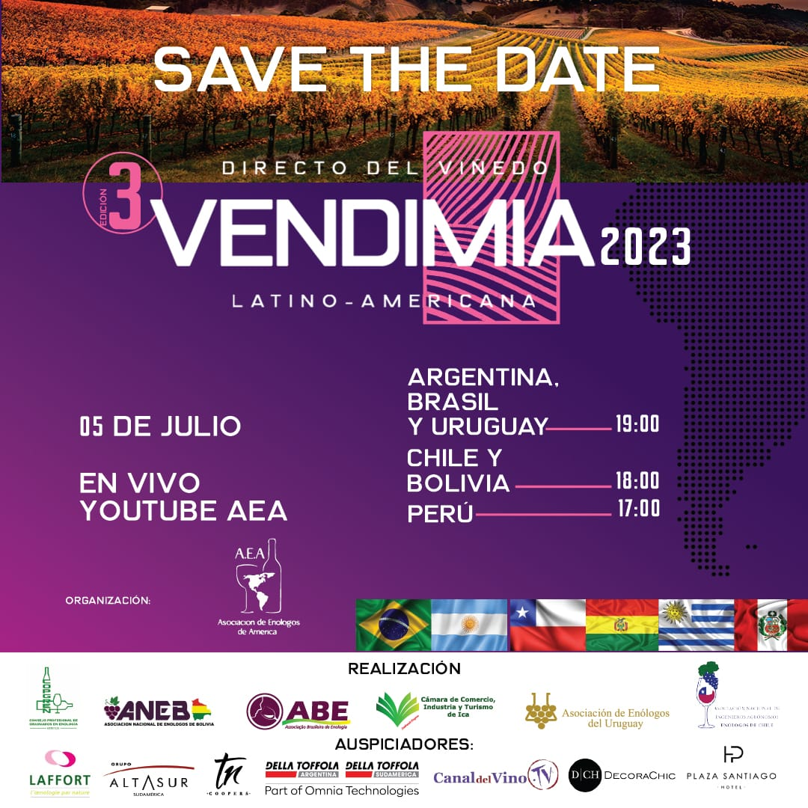

El evento "Directo del Viñedo 2023" es una oportunidad única que reúne a varios países latinoamericanos, como Argentina, Bolivia, Brasil, Chile, Perú y Uruguay, con el objetivo de fortalecer y promover la producción de vinos en la región.

Este encuentro, organizado por la Asociación de Enólogos de América (AEA), tiene como propósito principal mostrar la diversidad y calidad de los vinos latinoamericanos. Para lograrlo, se presentarán dos expositores por país: uno compartirá su experiencia desde el viñedo, destacando el proceso de cosecha, y el otro desde el punto de vista enológico, explicando cómo se elaboran los vinos. Será una oportunidad para obtener información valiosa sobre la vendimia 2023 en cada uno de los países participantes, incluyendo detalles sobre el clima, la calidad de los vinos y los rendimientos obtenidos.

El evento se transmitirá en vivo a través del canal de la Asociación de Enólogos de América en YouTube. Por primera vez, se ofrecerán 50 cupos para asistir de forma presencial en Santiago de Chile a las 18:00 horas. Además, al final del evento, habrá una sesión de preguntas en la que tanto los asistentes presenciales como los espectadores en línea podrán hacer sus consultas a los expositores.

Se podrá seguir la transmisión en vivo de forma gratuita.

Fecha: 5 de julio de 2023

Lugar: Transmisión en YouTube AEA

Hora: 19:00 - Uruguay

18:00 Chile y Bolivia

17:00 Perú
Para obtener más información, visita el sitio web: [https://enologosdeamerica.com/](https://enologosdeamerica.com/)