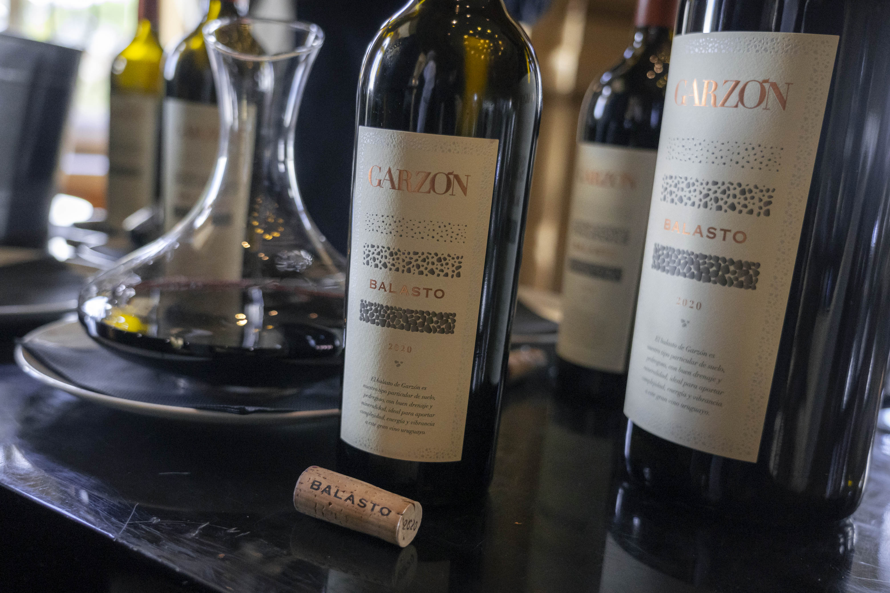

Bodega Garzón lanzó la añada 2020 de su vino ícono Balasto en una Avant Première realizada en el Hotel Sofitel de Carrasco en Montevideo.

Con la presencia de Alberto Antonini, winemaker italiano asesor de Bodega Garzón, y el enólogo uruguayo Germán Bruzzone, Gerente de Viñedos y Bodega, y responsable del día a día en la elaboración de los vinos de la bodega, pudimos adentrarnos en el mundo que da vida a este vino que lleva el nombre de un término utilizado para describir el suelo granítico de Garzón.

El Balasto 2020 es un blend captura el terroir de la región donde se encuentran los viñedos en Maldonado y está compuesto por un 42% de Tannat, 39% de Cabernet Franc y un 19% de Petit Verdot, el vino se somete a un proceso de fermentación en tulipas de cemento de 80 HL y una maduración de 20 meses en toneles de roble francés sin tostar. El blend no se mantiene constante, el Balasto 2018 tenía además de Tannat, Cabernet Franc y Petit Verdot, pequeñas cantidades de Merlot y Marselan. Germán y Alberto nos contaron durante el evento que la decisión del blend se realiza mediante rigurosas catas en donde evalúan cada detalle y cómo afecta cada una de las distintas variedades al resultado final del vino.

Mis notas sobre el Balasto 2020:

> “A la vista, presenta un color púrpura profundo. Su aroma tiene una intensidad elevada y aromas a frutas rojas y negras maduras, como ciruela, moras y arándanos. También tiene aromas a hierbas secas, como orégano y tomillo. La vainilla y los aromas tostados, procedentes de la crianza en toneles de roble, son sutiles y se integran en armonía con el vino. En boca, se percibe una acidez vibrante, taninos sedosos y marcados, y un final largo. Su graduación alcohólica es de 14.5%, y definitivamente es un vino con potencial de guarda.”

Se espera el lanzamiento oficial del Balasto 2020 el próximo 12 de septiembre de 2023 en La Place de Bordeaux.