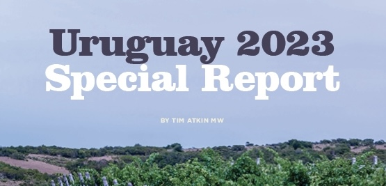

La última semana de enero del 2023 Tim Atkin volvió a Uruguay luego de la pandemia. En el 2021 Tim cató los vinos en Londres, mientras en Uruguay, enólogos y productores de las bodegas participantes cataban al mismo tiempo. Este verano tuve la oportunidad de acompañar a Tim Atkin en su recorrido por Uruguay por lo que estoy muy agradecida con Tim Atkin, Martina Litta de Uruguay Wine y todas las bodegas uruguayas participantes. También se renovó el voto de confianza de Tim con mi trabajo y fui responsable de la revisión de la sección del informe “Ten Things you need to know about Uruguay” y la selección de “Where to Eat and Drink in Uruguay ”.

En total se evaluaron cerca de 300 vinos, entre los que se encontraban vinos blancos, tintos, rosados, espumosos y fortificados, provenientes de diferentes regiones vitivinícolas del país. De esos vinos 210 obtuvieron más de 90 puntos y Tim escribió notas de cata de cada uno.

Algunos de los premios otorgados por Tim Atkin MW a los profesionales del vino uruguayos incluyen:

<ul>
 	<li class="li1">Winemaker del año: Pablo Fallabrino de Pablo Fallabrino</li>
 	<li class="li1">Joven winemaker del año: Martín Viggiano de Cerro del Toro</li>
 	<li class="li1">Viticultor del año: Gustavo Blumetto de Familia Deicas</li>
 	<li class="li1">Winemaker Leyenda: Laura Casella de Antigua Bodega Stagnari</li>
</ul>

Algunos de los vinos con puntuaciones más altas son:

Tintos
<ul>
 	<li class="li1">Garzón Balasto 2020 98 puntos</li>
 	<li class="li1">Garzón Petit Clos Block #560 Cabernet Franc 2020 97 puntos</li>
 	<li class="li1">Garzón Petit Clos Block # 212 Tannat 2020 96 puntos</li>
</ul>

Blancos
<ul>
 	<li class="li1">Compañía Uruguaya de Vinos de Mar Ter Admirabilis Albariño 2021 96 puntos</li>
 	<li class="li1">Familia Deicas Albariño Cru d’Exception 2020 96 puntos</li>
 	<li class="li1">Bouza Riesling 2020 95 puntos</li>
</ul>

Uruguay 2023 Special Report se puede comprar a través del sitio web de Tim Atkin, por una suma de £10 a través del siguiente enlace: [timatkin.com/product/2023-uruguay-special-report/](http://timatkin.com/product/2023-uruguay-special-report/)