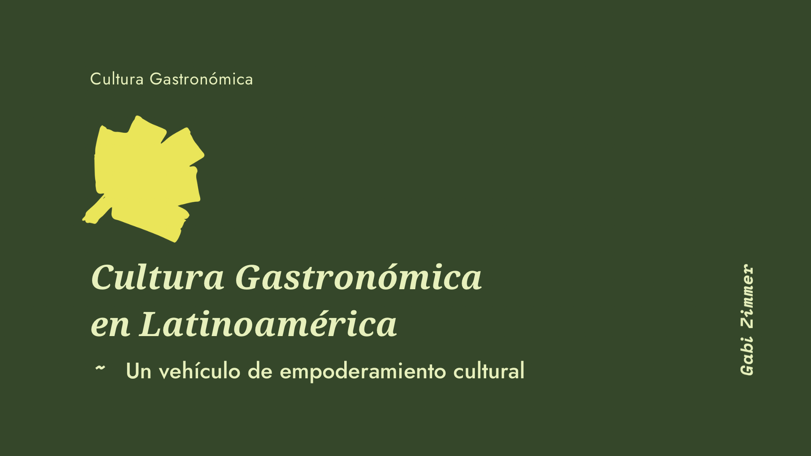

Hace tiempo le estoy dando vueltas a una idea sobre cómo el valor que le otorgamos a la cultura gastronómica es un acto de empoderamiento cultural.

Siempre me ha molestado esa idea de "esperar que alguien nos descubra" o menospreciar lo local y propio por lo extranjero, y no me refiero al patriotismo, o creer que algo es mejor o superior a otra cosa, sino a valorar nuestra identidad y celebrarla. Esperamos constantemente la validación externa porque no podemos decidir por nosotros mismos cuánto valemos.

> “El verdadero valor y autenticidad de nuestra cultura no viene de la validación externa, sino de la pasión, el respeto y la comprensión que le otorgamos nosotros mismos.”

En el mundo del vino lo veo todo el tiempo, "somos el secreto mejor guardado" esperando que venga un europeo salvador a descubrirnos. Ese es el complejo de colonización, tan arraigado en nuestra historia latinoamericana que aflora de forma inconsciente en nuestras acciones. No estoy criticando, es una observación sobre hechos de los que no soy ajena. También he buscado que alguien descubra mi potencial, mi valor y que me ofrezca las oportunidades que creía que no podía obtener por mí misma.
> “Valorar, promover y compartir la tradición vitivinícola y gastronómica local es un acto de empoderamiento cultural.”

Estoy aprendiendo, y reemplazando creencias, porque entiendo que el verdadero valor y autenticidad de nuestra cultura (en especial la gastronómica que es con la que más vínculo tengo) no viene de la validación externa, sino de la pasión, el respeto y la comprensión que le otorgamos nosotros mismos.